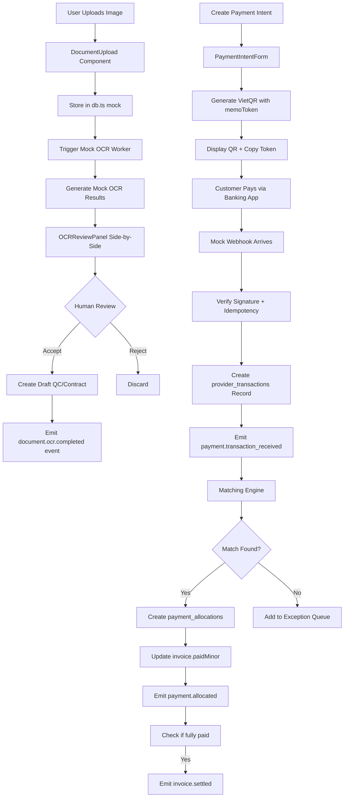

# Document Scanner + Vietnam Payment Coffee Business Manager Design

**Date:** 2024-09-13  
**Status:** Approved  
**Related:** Expanded Sprint Plan (.kilo/plans/[1788153435552-vietnam-payment-coffee-manager.md])

## Executive Summary

This design implements two tightly-coupled capabilities in a hybrid incremental approach:

1. **Document Scanner** - Mobile-first OCR pipeline for QC audits and contract uploads
2. **Vietnam Payment & Coffee Business Manager** - Full value-chain payment management with VietQR settlement

**Approach:** Phase 1 implements mock versions within the current React SPA to validate UX and workflows. Phase 2 replaces mocks with production backend per the GitHub repository architecture.

## Architecture Overview

### Current State
- React SPA with Zustand state management
- In-memory mock database (`db.ts`) and tRPC-like client (`client.ts`)
- Express server (AI proxy only)
- No real backend, no payments, no OCR

### Target State (Phase 2)
Per GitHub repo (`marcusdax/greensheet`):
- MySQL 8 + Drizzle ORM (serial PKs, bigint unsigned FKs)
- tRPC 11 server + Hono webhook routes
- PayOS/Casso/VietQR integrations
- OCR pipeline (vision model + LLM structured output)
- Transactional outbox with claim-based consumer

### Hybrid Approach
| Phase | Goal | Implementation |
|-------|------|----------------|
| **Phase 1** (Current) | Validate UX & workflows | Mock implementations in SPA |
| **Phase 2** (Future) | Production readiness | Real backend per GitHub repo |

## Phase 1: Mock Implementations

### Core Principles
- Reuse existing SPA patterns (Zustand slices, `client.ts` mocks)
- Mobile-first UI following Museum Folio design tokens
- Human-in-the-loop for all OCR extractions
- Idempotent payment flows with exception handling
- Static fixtures in `db.ts` for fast iteration

### Component Breakdown

#### 1. Document Scanner
**Use Cases:**
- QC Audit: Upload lab report → OCR extract → propose `qc_audits` draft
- Contract Upload: Upload signed contract → OCR extract → propose `contracts` draft

**Components:**
- `DocumentUpload.tsx` - Drag/drop + camera capture
- `OCRReviewPanel.tsx` - Side-by-side view with confidence badges
- `DocumentsPage.tsx` - List/view uploaded documents
- `DocumentsSlice.ts` - Zustand slice for document state

**Mock API (`client.ts` extensions):**
- `documents.upload` → returns `{documentId, uploadUrl, expiresAt}`
- `documents.confirmUpload` → validates SHA256, returns success
- `documents.getOcrResult` → returns mock OCR results with confidence
- `documents.ocr.completed` event → emits to outbox

**Mock OCR Simulation:**
- Uploaded image → deterministic mock extraction based on filename
- Confidence scores: 0.95 for financial fields, 0.85 for standard, 0.75 for advisory
- Human review required for financial/quality-critical fields regardless of confidence

#### 2. Vietnam Payment Manager
**Use Cases:**
- Create payment intent → generate VietQR → customer pays → webhook → allocate → clear AR
- AR aging buckets, exception queue, manual allocation/reversal

**Components:**
- `VietQRCode.tsx` - QR code + copyable memo token
- `PaymentIntentForm.tsx` - Create intents with idempotency key
- `ARAgingBucketBar.tsx` - Visual aging buckets (current, 30, 60, 90, 90+)
- `ExceptionQueue.tsx` - Unmatched/ambiguous/overpaid transactions
- `PaymentsPage.tsx` - Main payments/AR dashboard
- `PaymentsSlice.ts` - Zustand slice for payment state

**Mock API (`client.ts` extensions):**
- `intents.create` → requires idempotencyKey, returns payment intent
- `intents.cancel` → cancels pending intent
- `ar.aging` → returns aging buckets by counterparty/currency
- `transactions.list` → returns provider transactions with match status
- `allocations.create` → manual match transaction to invoice
- `allocations.reverse` → reverses allocation with reason
- Webhook handlers (`/webhooks/payos`, `/webhooks/casso`) → mock signature verification

**VietQR Mock Flow:**
1. `intents.create` → generates `memoToken` (AUC + 7-char Crockford base32)
2. Returns `qrCodeData` (EMVCo payload) and `checkoutUrl`
3. User scans QR or pays via banking app
4. Mock webhook arrives → signature verification → idempotent handling
5. On success: emit `payment.transaction_received` → allocation → AR decrement

### Data Flow



### State Management (Zustand Slices)

**documentsSlice:**
```typescript
interface DocumentsState {
  uploads: Record<string, {
    id: string;
    status: 'pending' | 'uploading' | 'completed' | 'failed';
    file: File;
    progress: number;
    error?: string;
  }>;
  ocrResults: Record<string, {
    documentId: string;
    structuredData: any;
    confidenceScores: Record<string, number>;
    modelVersion: string;
    reviewedByUserId?: string;
    reviewedAt?: string;
    reviewOutcome?: 'accepted' | 'edited' | 'rejected';
  }>;
  // actions: upload, confirmUpload, getOcrResult, acceptOCR, rejectOCR
}
```

**paymentsSlice:**
```typescript
interface PaymentsState {
  intents: Record<string, {
    id: string;
    invoiceId: string;
    amountMinor: number;
    currency: string;
    status: 'pending' | 'awaiting_payment' | 'paid' | 'failed' | 'cancelled';
    provider: 'payos' | 'casso' | 'manual';
    providerOrderCode?: string;
    qrCodeData?: string;
    checkoutUrl?: string;
    expiresAt: string;
  }>;
  transactions: Record<string, {
    id: string;
    provider: 'payos' | 'casso';
    providerTxnId: string;
    rawPayload: any;
    signatureValid: boolean;
    amountMinor: number;
    currency: string;
    description: string;
    matchStatus: 'unmatched' | 'matched' | 'ambiguous' | 'ignored' | 'manual_matched';
    matchedInvoiceId?: string;
    allocatedAmountMinor: number;
  }>;
  // actions: createIntent, cancelIntent, mockWebhook, createAllocation, reverseAllocation
}
```

### UI Components

Following existing patterns in `app/src/components/`:
- Reuse `Modal.tsx`, `Drawer.tsx`, `DataTable.tsx`, `InputField.tsx`
- Museum Folio design tokens from `tailwind.config.js`
- JetBrains Mono for monetary values and scores
- Tabular nums for aligned columns

**Key Screens:**
1. **Documents Page** (`/documents`)
   - Upload area (drag/drop + camera button)
   - Document list with status badges
   - Document detail view with OCR results
   
2. **OCR Review Panel** (Modal/Drawer)
   - Left: Original image (zoom/pan)
   - Right: Extracted fields with confidence badges
   - Financial fields: Always require explicit touch
   - Standard fields: Pre-filled with warnings for low confidence
   - Advisory fields: Pre-filled at any confidence
   - CTAs: Accept & Link, Reject, Reprocess

3. **Payments Page** (`/payments`)
   - Tabs: Open Intents, AR Aging, Exception Queue, Transaction History
   - VietQR display with copyable memo token
   - Aging buckets visual bars
   - Exception queue with filter/reason
   - Manual allocation dialog

### Security & Validation

**Document Scanner:**
- File type validation: JPEG, PNG, HEIC, PDF (25MB max)
- Mock virus scan before OCR (always passes in mock)
- SHA256 deduplication (same file hash won't re-trigger OCR)
- Scan status tracking: pending, clean, infected, skipped

**Vietnam Payment:**
- Idempotency key required for all mutations
- Mock webhook signature verification (always valid in mock)
- Amount validation: cannot exceed invoice total
- Currency matching: VND only for domestic flows
- Manual allocation requires ops_manager or platform_admin role

### Testing Strategy

**Unit Tests:**
- Zod schema validation for all DTOs
- State slice reducer tests (add/update/remove)
- Component rendering with props
- Mock OCR confidence gating logic

**Integration Tests:**
- Document upload → OCR → review → accept flow
- Payment intent creation → QR generation → mock webhook → allocation
- Idempotency: duplicate key + same body returns original
- Idempotency conflict: duplicate key + different body returns 422
- Exception queue population for unmatched payments

**Mock-Specific Tests:**
- Document Scanner: Verify financial fields require explicit touch
- Vietnam Payment: Verify AR aging computed correctly
- Both: Verify mock data persists in `db.ts` fixtures

## Phase 2: Production Backend (Future)

After Phase 1 UX validation, replace mocks with real infrastructure:

### Database Schema (`db/manager-schema.ts` + `db/payments-schema.ts`)
- MySQL 8 + Drizzle ORM
- Serial PKs, bigint unsigned FKs
- Money as bigint minor units + currency char(3)
- Tables: `invoices`, `payment_intents`, `provider_transactions`, `payment_allocations`, `documents`, `ocr_results`
- Soft deletes with `deletedAt`
- Indexes on foreign keys, status, createdAt, providerTxnId, idempotencyKey

### API Layer
- **tRPC 11** for application surface (`app/api/routers/manager.ts`, `payments.ts`)
- **Hono routes** for webhooks (`app/api/webhooks/payos.ts`, `casso.ts`)
- **Transactional outbox** (`app/api/engine.ts` rewrite)
- **Claim-based consumer** (`app/api/outbox/consumer.ts`)

### OCR Pipeline
- Adapt `marcusdax/vision-ocr-ai-agent-logistics`
- Image preprocessing → multi-engine OCR → LLM structured output
- Confidence scoring per field
- Human review UI with per-field confidence badges
- Store raw images + OCR JSON in `documents`/`ocr_results`

### Payment Integrations
- **PayOS**: HMAC-SHA256 signature verification, direct AR credit on success
- **Casso**: Static shared secret, requires API re-fetch before allocation
- **VietQR**: Memo token matching (AUC + 7-char Crockford base32)
- **Idempotency**: Proper idempotency records table with fingerprints

### Money Modeling
- All monetary values as integer cents (VND) or subunits
- Currency code stored explicitly with every amount
- Helpers: `formatMinor`, `parseMinor`, `roundScore`
- No floating-point for money

## Implementation Risks & Mitigations

| Risk | Probability | Impact | Mitigation |
|------|-------------|--------|------------|
| UX doesn't match real provider behavior | Medium | High | Phase 1 mocks use realistic flows; validate with sandbox credentials early |
| OCR confidence gating too restrictive | Low | Medium | Financial fields always require human review per ADR-04; standard/advisory tiers validated |
| Payment exception queue grows unmanaged | Medium | High | Manual allocation UI; automatic retry with backoff; monitoring alerts |
| Infrastructure complexity delays delivery | High | Medium | Phase 1 validates UX first; Phase 2 can be scoped/incremental |
| Token collision in VietQR memo | Low | High | AUC prefix + 7-char Crockford base32 = 10 chars; check uniqueness on insert |

## Success Criteria

**Phase 1 (Mock):**
- [ ] Document Scanner: Upload → mock OCR → review → accept creates draft
- [ ] Vietnam Payment: Create intent → VietQR → mock webhook → allocation → AR cleared
- [ ] All mocks use existing SPA patterns (Zustand slices, client.ts mocks)
- [ ] UI follows Museum Folio design tokens
- [ ] Unit tests pass for new components and slices
- [ ] Manual testing confirms workflows

**Phase 2 (Production) - Future:**
- [ ] MySQL + Drizzle schema migrations apply cleanly
- [ ] tRPC server + Hono routes respond correctly
- [ ] PayOS/Casso webhook integrations verified with sandbox
- [ ] OCR pipeline extracts structured data with confidence
- [ ] Outbox consumer processes events with idempotency
- [ ] Money modeling uses integer cents only
- [ ] End-to-end tests validate full flow

## Open Questions

1. **Mock data persistence:** Should Phase 1 mocks use static fixtures or LocalStorage for persistence across reloads?
2. **Entry points:** Should new capabilities be top-level routes (`/documents`, `/payments`) or integrated into existing pages (lot detail, contract create)?
3. **Production timing:** Should Phase 2 begin immediately after Phase 1 approval, or after a set period of UX validation?
4. **Provider sandbox:** Do we have access to PayOS/Casso sandbox credentials for Phase 2 testing?

## Next Steps

1. Write implementation plan using `writing-plans` skill
2. Begin Phase 1 implementation:
   - DocumentUpload component
   - OCRReviewPanel component  
   - DocumentsPage route
   - PaymentsPage route
   - VietQRCode component
   - Extend `client.ts` mocks
   - Add Zustand slices
   - Write unit tests

---
*Design approved via brainstorming skill process. Implementation to proceed with writing-plans skill.*