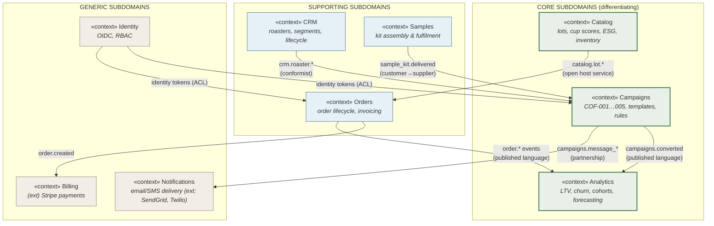
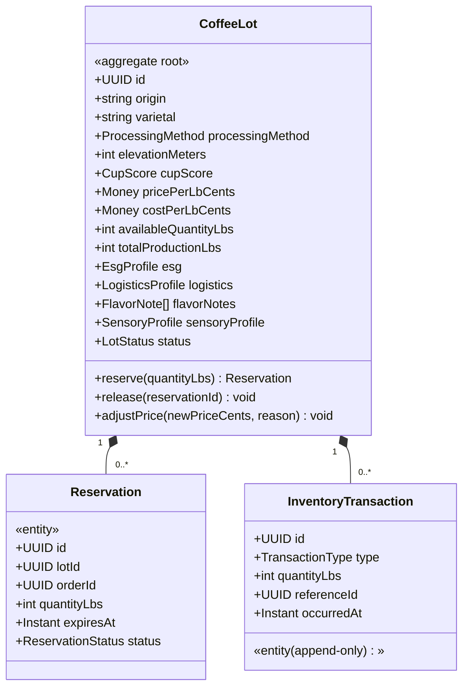
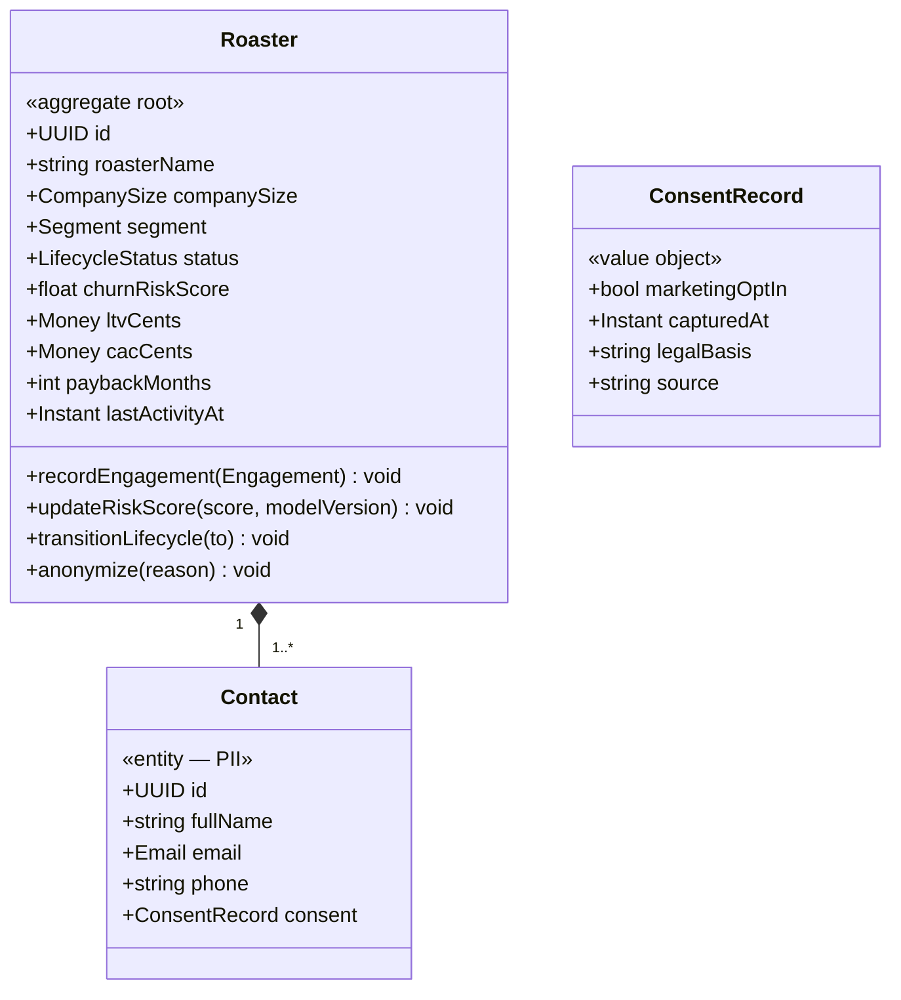
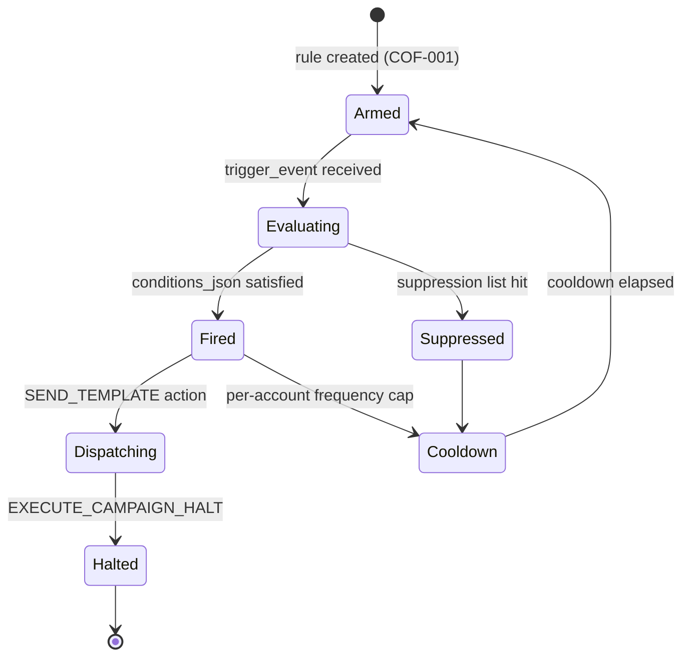
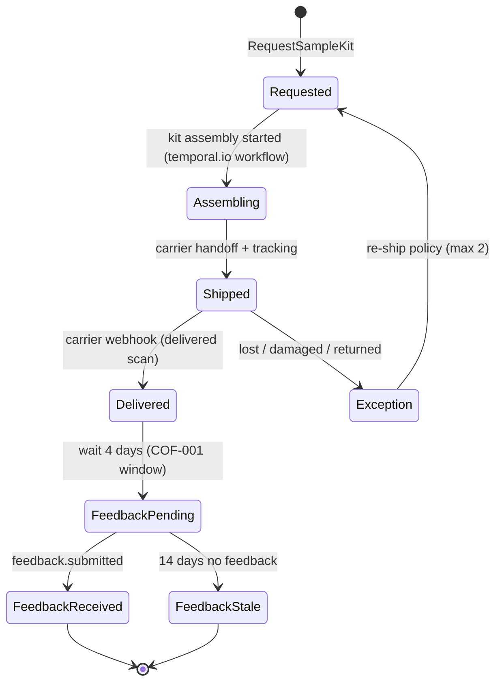
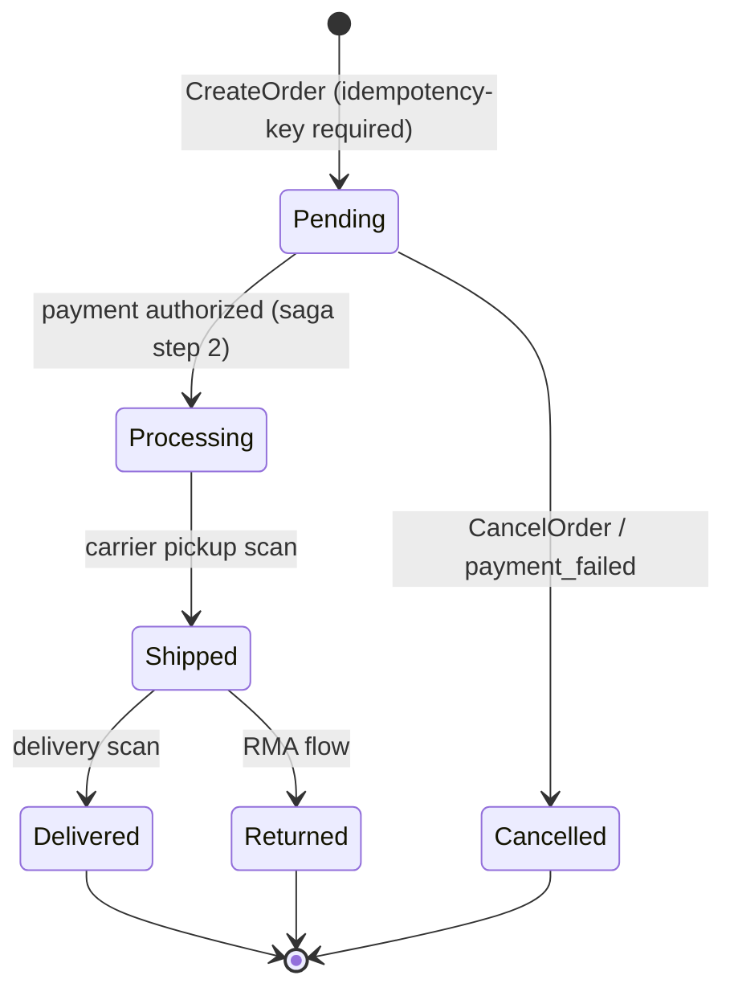
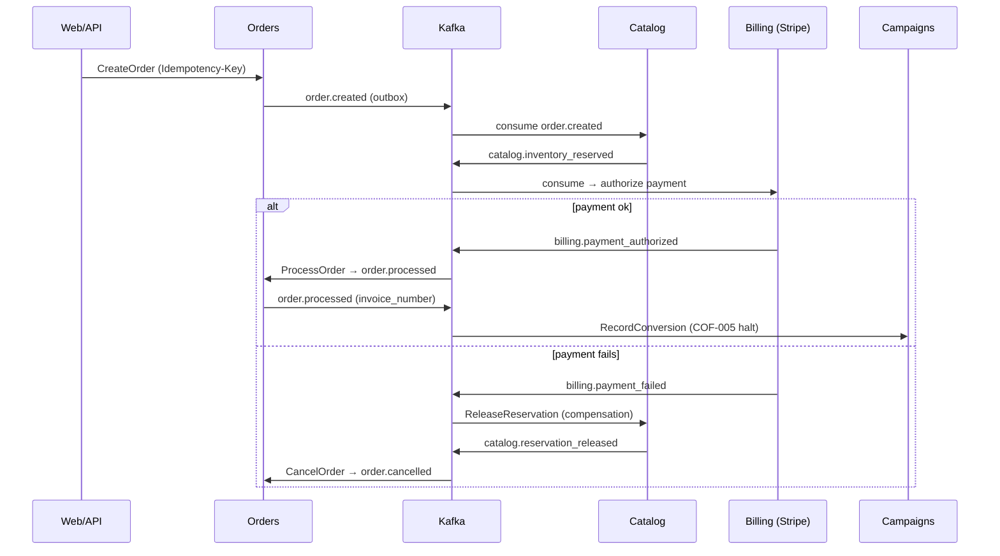

# 01 — Domain Model & Event Storming

> **Extends:** Base Doc §I.3 (Software Engineering & Systems Architecture), §V (Backend Services), and the marketing schema's `automation_rules` trigger catalogue (`sample_kit.delivered`, `feedback.submitted`).
> **Purpose:** This is the canonical output of the Greensheet domain-modelling event-storming workshop. It defines bounded contexts, aggregates, commands, domain events, and reactive policies that every downstream artefact in this series (OpenAPI contract, Kafka topology, DB migrations, frontend stores) must conform to.

---

## 1. Workshop Conventions (Legend)

| Sticky / Colour | DDD Concept | Notation in this doc |
|---|---|---|
| 🟧 Orange | **Domain Event** (something that happened, past tense) | `context.entity.verb_past` e.g. `order.created` |
| 🟦 Blue | **Command** (an intention, imperative) | `VerbNoun` e.g. `ReserveInventory` |
| 🟨 Yellow | **Aggregate** (consistency boundary / transactional unit) | `«aggregate» Name` |
| 🟩 Green | **Read Model / Projection** | `«projection» Name` |
| 🟪 Purple | **Policy** (reactive rule: *whenever* E, *then* C) | `«policy» OnEventDoCommand` |
| 🟥 Red | **Hotspot** (open question, conflict, risk) | `⚠ HOTSPOT:` |
| ⬜ White | **External System** | `(ext) Name` |

**Naming rules (binding for all services):**

1. Domain events use the snake_case dotted form already established by the base doc and the marketing schema: `order.created`, `sample_kit.delivered`, `feedback.submitted`. When transported over Kafka they are wrapped in a CloudEvents envelope (see `03-event-driven-pipeline.md`).
2. Money is always integer **cents** (`*_cents`) at rest and on the wire; the frontend converts to dollars (`pricePerLb`) only at the presentation boundary (Base Doc §III.3.2, §IV.4.2).
3. Every aggregate mutation emits exactly one *primary* domain event via the transactional outbox; compensating actions emit their own events.

---

## 2. Big-Picture Event Flow (Discovery → Revenue)

The workshop mapped the end-to-end value stream of the COF-001–005 nurture funnel (Base Doc §I.2, marketing schema §4) onto a single timeline. This is the "big picture" event storm.

```mermaid
flowchart LR
    subgraph P1["Phase 1 · Acquisition"]
        E1(["crm.roaster.registered"]) --> E2(["samples.kit.requested"])
        E2 --> E3(["samples.kit.assembled"])
        E3 --> E4(["samples.kit.shipped"])
        E4 --> E5(["sample_kit.delivered"])
    end

    subgraph P2["Phase 2 · Nurture (COF-001…005)"]
        E5 --> E6(["campaigns.rule_triggered<br/>COF-001"])
        E6 --> E7(["campaigns.message_sent"])
        E7 --> E8(["campaigns.message_opened"])
        E8 --> E9(["campaigns.link_clicked"])
        E9 --> E10(["feedback.submitted"])
        E10 --> E11(["campaigns.rule_triggered<br/>COF-002…COF-005"])
    end

    subgraph P3["Phase 3 · Revenue"]
        E11 --> E12(["order.created"])
        E12 --> E13(["order.processed"])
        E13 --> E14(["order.shipped"])
        E14 --> E15(["order.delivered"])
        E15 --> E16(["campaigns.converted"])
    end

    subgraph P4["Phase 4 · Retention"]
        E15 --> E17(["crm.ltv_recalculated"])
        E17 --> E18(["crm.churn_risk_detected"])
        E18 --> E19(["crm.intervention_started"])
        E19 --> E20(["crm.roaster_retained"])
        E19 -.-> E21(["crm.roaster_churned"])
    end

    style P1 fill:#fdf3e3,stroke:#a8721f
    style P2 fill:#e8f0e8,stroke:#2f6b4a
    style P3 fill:#e6f0f7,stroke:#4a6b8f
    style P4 fill:#fce8e6,stroke:#a63f33
```

**Key causal spine (happy path):** `sample_kit.delivered` is the *pivotal event* — it is the `trigger_event` for automation rule **COF-001** in `automation_rules` (marketing schema §1) and starts the 3-touch email/SMS sequence. `feedback.submitted` gates progression to COF-002+ and is also the trigger for CRM lifecycle updates (`UPDATE_CRM_LIFECYCLE` rule action).

---

## 3. Bounded Context Map

Six core contexts were identified, matching — and refining — the microservice decomposition in Base Doc §I.3 (Auth, Inventory, Order, Analytics, Notification services). Two *supporting* contexts (Identity, Notifications) and one *generic* context (Billing/Payments) sit around the core.

### 3.1 Context Relationship Catalogue

| Upstream → Downstream | Pattern | Rationale |
|---|---|---|
| Samples → Campaigns | **Customer–Supplier** | Samples owns kit lifecycle truth; Campaigns consumes `sample_kit.delivered` as a rule trigger with an agreed schema (marketing schema `automation_rules.trigger_event`). |
| Campaigns → Notifications | **Partnership** | Templates/rendering owned by Campaigns; transport owned by Notifications; both share the token dictionary contract (`campaign_tokens`). |
| Catalog → Orders | **Open Host Service** | `GET /v1/catalog/lots` is the published language; Orders never reaches into Catalog tables. |
| CRM → Campaigns | **Conformist** | Campaigns adopts CRM's segmentation vocabulary (`segment`, `status`) without translation. |
| Identity → all | **Anti-Corruption Layer** | Internal services never parse OIDC tokens directly; an ACL translates to an internal `Principal` (see `07-security-compliance.md`). |
| Orders/Campaigns → Analytics | **Published Language** | Analytics consumes only CloudEvents from Kafka topics — zero database coupling (fixes the implicit coupling in Base Doc §5.2 where `AnalyticsService` queries `orders` directly). |

---

## 4. Context Detail

### 4.1 Catalog Context

> Maps to: `coffee_lots`, `inventory_transactions` tables (Base Doc §III.3.2); Navigator UI (§IV.4.2); Inventory Service (§I.3).

**Ubiquitous language:** *Lot* (a discrete green-coffee parcel with shared origin/harvest), *Cup Score* (SCA 0–100), *Spot* vs *Afloat* inventory (physical position), *Reservation* (soft hold pending order payment).

**Aggregates & entities:**

**Commands (blue stickies):**

| Command | Actor | Aggregate | Emits |
|---|---|---|---|
| `RegisterLot` | Importer/ops | CoffeeLot | `catalog.lot_registered` |
| `UpdateLotPricing` | Pricing service / ops | CoffeeLot | `catalog.price_changed` |
| `ReserveInventory` | Order saga | CoffeeLot | `catalog.inventory_reserved` |
| `ReleaseReservation` | Order saga (compensation) | CoffeeLot | `catalog.reservation_released` |
| `ReceiveShipment` | Warehouse ops | CoffeeLot | `catalog.shipment_received` |
| `AdjustInventory` | Ops (QC loss, shrink) | CoffeeLot | `catalog.inventory_adjusted` |
| `RetireLot` | Ops | CoffeeLot | `catalog.lot_retired` |

**Invariants (enforced inside the aggregate — never in the service layer):**

1. `availableQuantityLbs ≥ 0` — reservation fails with `InsufficientInventory` domain error (see error code `GS-CAT-1001` in `02-openapi-contract.md`).
2. `pricePerLbCents > 0`; a price below `costPerLbCents` is legal (clearance) but emits `catalog.margin_floor_breached` for the Analytics context to alert on.
3. A retired lot (`status = 'retired'`) rejects all reservations but remains readable for historical orders (`ON DELETE RESTRICT` per Base Doc §III).

**Policies (purple stickies):**

- `OnOrderCreatedReserveInventory` — when `order.created` → `ReserveInventory` (saga step, Base Doc §5.1 `reserveInventory`).
- `OnPaymentFailedReleaseReservation` — when `billing.payment_failed` → `ReleaseReservation` (compensating action; closes the gap in Base Doc §5.1 where inventory was never restored on failure).
- `OnReservationExpiredRelease` — scheduled policy, 30-minute TTL, prevents inventory leaks from abandoned checkouts.

---

### 4.2 CRM Context

> Maps to: `accounts`, `churn_interventions` (Base Doc §III.3.2); LTV/churn models (§II.2.1–2.2); churn intervention tables extended in `04-database-evolution.md`.

**Ubiquitous language:** *Roaster* (the business; `accounts.roaster_name`), *Contact* (a person with PII), *Lifecycle Stage* (`trial → active → dormant → churned`), *Engagement* (any telemetry touch), *Risk Score* (Cox partial hazard, normalized 0–1).

**Aggregate — Roaster:**

**Commands → Events:**

| Command | Emits | Notes |
|---|---|---|
| `RegisterRoaster` | `crm.roaster_registered` | Entry of funnel; carries `utm_*` attribution from campaign engagement. |
| `RecordEngagement` | `crm.engagement_recorded` | Feeds `engagements6mo` feature (Base Doc §II.2.2). |
| `UpdateChurnRiskScore` | `crm.churn_risk_detected` | Emitted only on threshold crossing (≥ 0.7, per `ChurnPredictor.get_high_risk_roasters` §II.2.2) to avoid event spam. |
| `StartIntervention` | `crm.intervention_started` | Creates row in `churn_interventions` (`intervention_type`: `email_campaign`/`sales_call`/`discount_offer`/`survey`). |
| `ResolveIntervention` | `crm.intervention_resolved` | Outcome `retained` / `churned` / `pending`. |
| `AnonymizeRoaster` | `crm.roaster_anonymized` | GDPR erasure — crypto-shreds PII, keeps financial facts (see `07-security-compliance.md` §5). |

**Policies:**

- `OnChurnRiskDetectedStartIntervention` — risk ≥ 0.7 → `StartIntervention` (auto-assign round-robin to CSM; Base Doc §I.2 "Churn Intervention Workflows").
- `OnSampleKitDeliveredNudgeLifecycle` — `sample_kit.delivered` → `RecordEngagement` with `engagementType = 'sample_received'`.
- `OnOrderDeliveredRecalculateLtv` — recomputes discounted LTV using `LTVCalculator` (§II.2.1) and stores `ltv_cents` on the Roaster.

---

### 4.3 Campaigns Context

> Maps to: `campaigns`, `campaign_tokens`, `marketing_templates`, `automation_rules`, `rule_actions`, `view_compiled_campaign_rules` (marketing schema §1–3); `campaign_engagements`, `ab_tests` (Base Doc §III.3.2); Campaign Intelligence UI (§IV.4.4).

**Ubiquitous language:** *Campaign* (versioned container, e.g. `cof-nurture-2025`), *Rule* (COF-001…COF-005 trigger/condition pair), *Action* (`SEND_TEMPLATE`, `EXECUTE_CAMPAIGN_HALT`, `UPDATE_CRM_LIFECYCLE`), *Token* (merge tag like `{sca_cup_score}`), *Touchpoint* (step in sequence), *Variant* (A/B arm: `subject_variant_a`/`subject_variant_b`).

**The COF-001…COF-005 rule model (canonical):**

| Rule | Trigger event | Core condition (`conditions_json`) | Primary action |
|---|---|---|---|
| **COF-001** | `sample_kit.delivered` | `{"days_since_delivery": 4}` | Send Touch-1 email (origin story + cupping notes) |
| **COF-002** | `feedback.submitted` | `{"feedback.rating_gte": 4}` | Send Touch-2 email (pricing sheet w/ `{sca_cup_score}` token) |
| **COF-003** | `feedback.submitted` | `{"feedback.rating_lte": 2}` | `UPDATE_CRM_LIFECYCLE` → `needs_attention` + SMS consultative variant (`option_b_consultative`) |
| **COF-004** | `campaigns.link_clicked` | `{"clicked.pricing_page": true}` | Send Touch-3 email (volume discount CTA) |
| **COF-005** | `order.created` | `{"first_order": true}` | `EXECUTE_CAMPAIGN_HALT` for nurture + enroll in onboarding stream |

**Aggregates:**

| Aggregate | Root entity | Invariants |
|---|---|---|
| `Campaign` | `campaigns` row | A campaign has exactly one `active` version; retiring cascades children (`ON DELETE CASCADE`, marketing schema §1). |
| `AutomationRule` | `automation_rules` row | `trigger_event` must exist in the platform event catalogue (§6 below); `conditions_json` must validate against the condition schema for that trigger. |
| `MessageDispatch` | per-send ledger row (`campaign_execution_logs`, added in `04-database-evolution.md`) | One dispatch per (rule, account, touchpoint, idempotency-key); a halted campaign rejects new dispatches. |

**Commands → Events:**

| Command | Emits |
|---|---|
| `ActivateCampaign` | `campaigns.activated` |
| `TriggerRule` | `campaigns.rule_triggered` |
| `DispatchMessage` | `campaigns.message_sent` (then provider webhooks produce `campaigns.message_opened`, `campaigns.link_clicked`) |
| `RecordConversion` | `campaigns.converted` (links `converted_order_id`) |
| `HaltCampaign` | `campaigns.halted` |

**Policies:**

- `OnTriggerEventEvaluateRules` — platform event bus → `TriggerRule` for each armed rule matching `trigger_event` (this is the runtime engine behind `view_compiled_campaign_rules`).
- `OnMessageOpenedNoClickFollowUp` — opened but no click within 72h → enqueue reminder variant (Thompson-sampled arm selection, Base Doc §I.2).
- `OnOrderCreatedHaltNurture` — `order.created` with `first_order = true` → `HaltCampaign` (COF-005) + `RecordConversion` (writes `campaign_engagements.converted_order_id`).

---

### 4.4 Samples Context

> Maps to: Base Doc §I.2 "Automated Sample Kit Fulfillment" (temporal.io orchestration); the `sample_kit.delivered` trigger consumed by Campaigns.

**Aggregate — SampleKit state machine:**

**Commands → Events:**

| Command | Emits | Transport topic |
|---|---|---|
| `RequestSampleKit` | `samples.kit_requested` | `gs.samples.events.v1` |
| `AssembleKit` | `samples.kit_assembled` | `gs.samples.events.v1` |
| `ShipKit` | `samples.kit_shipped` | `gs.samples.events.v1` |
| `MarkKitDelivered` | **`sample_kit.delivered`** ⚠ exact string — contract with `automation_rules.trigger_event` | `gs.samples.events.v1` |
| `SubmitFeedback` | **`feedback.submitted`** ⚠ exact string | `gs.samples.events.v1` |
| `MarkKitException` | `samples.kit_exception` | `gs.samples.events.v1` |

**Invariants:** max 2 active kits per roaster; a kit references exactly the lot IDs present in `coffee_lots` at assembly time (snapshot of `cup_score`, `price_per_lb_cents` copied onto the kit — orders placed from a kit quote the snapshot, not the live lot, preventing bait-and-switch pricing).

---

### 4.5 Orders Context

> Maps to: `orders`, `order_line_items` (Base Doc §III.3.2); `OrderService` (§5.1); idempotency for financial operations (§I.3).

**Aggregate — Order lifecycle:**

**Saga choreography (extends the orchestration-lite style of Base Doc §5.1 into a fully compensated flow):**

**Commands → Events:** `CreateOrder → order.created` · `ProcessOrder → order.processed` · `ShipOrder → order.shipped` · `DeliverOrder → order.delivered` · `CancelOrder → order.cancelled` · `ReturnOrder → order.returned` · `FailOrderProcessing → order.processing_failed` (all six strings already emitted by Base Doc `OrderService` — preserved verbatim).

**Invariants:**

1. `final_total_cents = quantity_lbs × unit_price_cents + shipping + tax − discount` — enforced as a `GENERATED ALWAYS … STORED` column (Base Doc §III.3.2), never computed in app code.
2. Order IDs are client-replayable via `Idempotency-Key` header (see `02-openapi-contract.md` §3); duplicate submissions return `200` + the original order, never a second charge.
3. Multi-lot orders: the Order aggregate owns `order_line_items`; inventory is reserved per line, and partial reservation failure rolls the whole saga back (atomicity at the aggregate boundary).

---

### 4.6 Analytics Context (Read Side)

> Maps to: `AnalyticsService` (Base Doc §5.2), `platform_metrics` hypertable (§III.3.2), KPIs (§XI); extended telemetry in `04-database-evolution.md`.

Analytics is a **pure downstream context**: it owns no commands and mutates no other context. It consumes the published-language topics and maintains projections.

| Projection (green sticky) | Source events | Storage |
|---|---|---|
| `«projection» CohortRetention` | `order.created`, `order.delivered` | TimescaleDB `analytics.cohort_monthly` (continuous aggregate) |
| `«projection» RoasterLtv` | `order.delivered`, `crm.roaster_registered` | `accounts.ltv_cents` write-back + `analytics.ltv_snapshots` |
| `«projection» ChurnRiskFeatures` | `crm.engagement_recorded`, `order.*`, `campaigns.message_*` | `analytics.churn_features` (feeds `ChurnPredictor`, §II.2.2) |
| `«projection» CampaignFunnel` | `campaigns.message_sent/opened/link_clicked/converted` | `analytics.campaign_funnel_daily` |
| `«projection» ViralCoefficient` | `referral.*` (new tables, `04-database-evolution.md`) | `analytics.referral_daily` |
| `«projection» LotDemandForecast` | `order.created`, `catalog.lot_registered` | Prophet/ARIMA features (§I.1) |

**⚠ HOTSPOT (resolved):** Base Doc §5.2 has `AnalyticsService` querying `orders` and `accounts` tables directly. The event-storming workshop flagged this as cross-context table coupling. **Decision:** during Phase 1 the direct-read service remains as the *tactical* implementation; Phase 2 backfills `analytics.*` projections from Kafka + a one-time snapshot job, after which table access is revoked (enforced via the role grants in `04-database-evolution.md` §7).

---

## 5. Consolidated Policy Matrix

| # | When (event) | Then (command) | Owning context | Base-doc trace |
|---|---|---|---|---|
| P-01 | `order.created` | `ReserveInventory` | Catalog | §5.1 `reserveInventory` |
| P-02 | `billing.payment_failed` | `ReleaseReservation` | Catalog | *new — closes compensation gap* |
| P-03 | `billing.payment_authorized` | `ProcessOrder` | Orders | §5.1 `processOrderAsync` |
| P-04 | `sample_kit.delivered` | `TriggerRule` (COF-001) | Campaigns | marketing schema §4 |
| P-05 | `feedback.submitted` (rating ≥ 4) | `TriggerRule` (COF-002) | Campaigns | marketing schema §4 |
| P-06 | `feedback.submitted` (rating ≤ 2) | `TriggerRule` (COF-003) + `StartIntervention` | Campaigns + CRM | marketing schema §4 |
| P-07 | `order.created` (first order) | `HaltCampaign` (COF-005) + `RecordConversion` | Campaigns | marketing schema §4 |
| P-08 | `crm.churn_risk_detected` | `StartIntervention` | CRM | §I.2 churn workflows |
| P-09 | `order.delivered` | `RecalculateLtv` → `UpdateLtvSnapshot` | Analytics → CRM | §II.2.1 |
| P-10 | `campaigns.message_opened` ∧ ¬clicked 72h | `DispatchMessage` (reminder variant) | Campaigns | §I.2 Thompson sampling |
| P-11 | `catalog.lot_retired` | `NotifyWaitlist` | Notifications | *new* |
| P-12 | `crm.roaster_registered` (referred) | `AttributeReferral` | CRM → Analytics | §I.2 referral engine |

---

## 6. Domain Event Catalogue (Authoritative)

All events are CloudEvents 1.0 on the wire; `type` below is the CloudEvents `type` attribute (version suffix `.v1` elided for readability). Full Avro schemas in `03-event-driven-pipeline.md`.

| Event type | Producer | Key payload fields | Consumers |
|---|---|---|---|
| `catalog.lot_registered` | Catalog | lotId, origin, cupScore, pricePerLbCents, costPerLbCents, availableQuantityLbs | Analytics, Notifications |
| `catalog.price_changed` | Catalog | lotId, oldPricePerLbCents, newPricePerLbCents, reason | Analytics (pricing elasticity, §II.2.3) |
| `catalog.inventory_reserved` / `catalog.reservation_released` | Catalog | lotId, reservationId, orderId, quantityLbs | Orders (saga), Analytics |
| `crm.roaster_registered` | CRM | roasterId, segment, utmSource, referralCode | Campaigns, Analytics |
| `crm.churn_risk_detected` | CRM | roasterId, riskScore, modelVersion, topFeatures | CRM (policy), Notifications |
| `samples.kit_requested` / `samples.kit_shipped` | Samples | kitId, roasterId, lotIds[], trackingNumber | Notifications |
| **`sample_kit.delivered`** | Samples | kitId, roasterId, deliveredAt, lotIds[] | **Campaigns (COF-001)**, CRM |
| **`feedback.submitted`** | Samples | kitId, roasterId, rating, notes, lotRatings[] | **Campaigns (COF-002/003)**, Analytics |
| `campaigns.rule_triggered` | Campaigns | ruleCode (COF-001…005), campaignId, roasterId, conditionsMatched | Analytics |
| `campaigns.message_sent/opened/link_clicked` | Campaigns | dispatchId, ruleCode, variantName, templateId, roasterId | Analytics |
| `campaigns.converted` | Campaigns | campaignId, roasterId, convertedOrderId, attributedTouchpoints | Analytics, CRM |
| `order.created/processed/shipped/delivered/cancelled/processing_failed` | Orders | orderId, accountId, lineItems[{lotId, quantityLbs, unitPriceCents}], finalTotalCents | Catalog, Billing, Campaigns, Analytics |
| `billing.payment_authorized/payment_failed` | Billing | orderId, amountCents, failureCode | Orders, Catalog |
| `referral.code_created/link_clicked/attributed/reward_granted` | CRM | referralCode, referrerId, refereeRoasterId, rewardCents | Analytics (viral coefficient) |

---

## 7. Hotspots & Open Questions (Red Stickies)

1. **⚠ Multi-currency:** `*_cents` assumes USD. LatAm exporter invoicing needs a `currency` field on `Money`. *Decision deferred to Q3; schema预留 `currency CHAR(3) DEFAULT 'USD'` in new tables (`04-database-evolution.md`).*
2. **⚠ Lot vs. Blend:** roasters increasingly buy pre-blended lots. A `BlendLot` aggregate referencing component lots is parked; current model treats blends as opaque lots.
3. **⚠ `feedback.submitted` identity:** feedback arrives from a public link — spoofing risk. Mitigation: signed one-time token in the feedback URL (see `07-security-compliance.md` §8).
4. **⚠ COF rule versioning mid-flight:** editing `conditions_json` while a roaster is mid-sequence can double-send. Mitigation: rule edits create a new rule version; in-flight sequences pin the version they started on (tracked in `campaign_execution_logs.rule_version`, `04-database-evolution.md`).
5. **⚠ Analytics write-back to `accounts.ltv_cents`:** technically cross-context mutation. Accepted pragmatically (single-writer principle: only the LTV projector writes that column); revisit if CRM needs local LTV logic.

---

## 8. Ubiquitous Language Glossary

| Term | Definition | Where it lives |
|---|---|---|
| **Roaster** | A specialty-coffee roasting business (buyer). Not the person. | CRM `accounts` |
| **Lot** | A discrete parcel of green coffee with one origin, harvest, and price. | Catalog `coffee_lots` |
| **Cup Score** | SCA quality score 0–100; token `{sca_cup_score}`. | Catalog / Campaigns |
| **Sample Kit** | A curated box of small lot samples sent to a prospect roaster. | Samples |
| **Touchpoint** | One numbered step of a campaign sequence (email or SMS). | Campaigns `marketing_templates.touchpoint` |
| **Rule (COF-xxx)** | A trigger/condition/action triple driving automation. | Campaigns `automation_rules` |
| **Suppression** | A roaster-level opt-out that blocks dispatch. | Campaigns suppression list |
| **Intervention** | A retention action triggered by churn risk. | CRM `churn_interventions` |
| **Conversion** | First order attributable to a campaign touchpoint. | Campaigns `campaign_engagements.converted_order_id` |
| **Reservation** | A 30-min soft hold on lot quantity pending payment. | Catalog |
| **LTV** | Discounted lifetime margin: `Σ (Mₜ·Rₜ)/(1+d)ᵗ − CAC` (Base Doc §II.2.1). | Analytics → CRM |

---

*Next: the HTTP surface for these contexts is specified in `02-openapi-contract.md`; the event transport in `03-event-driven-pipeline.md`.*
