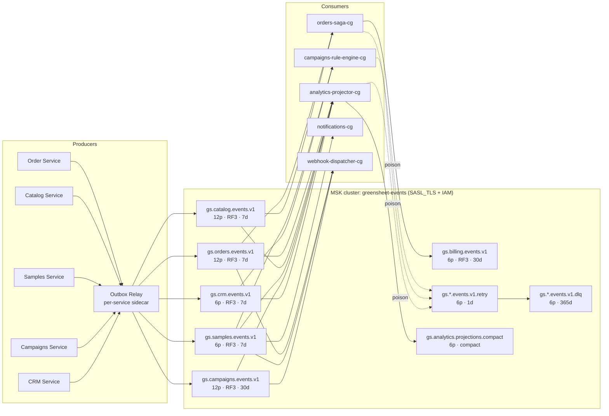
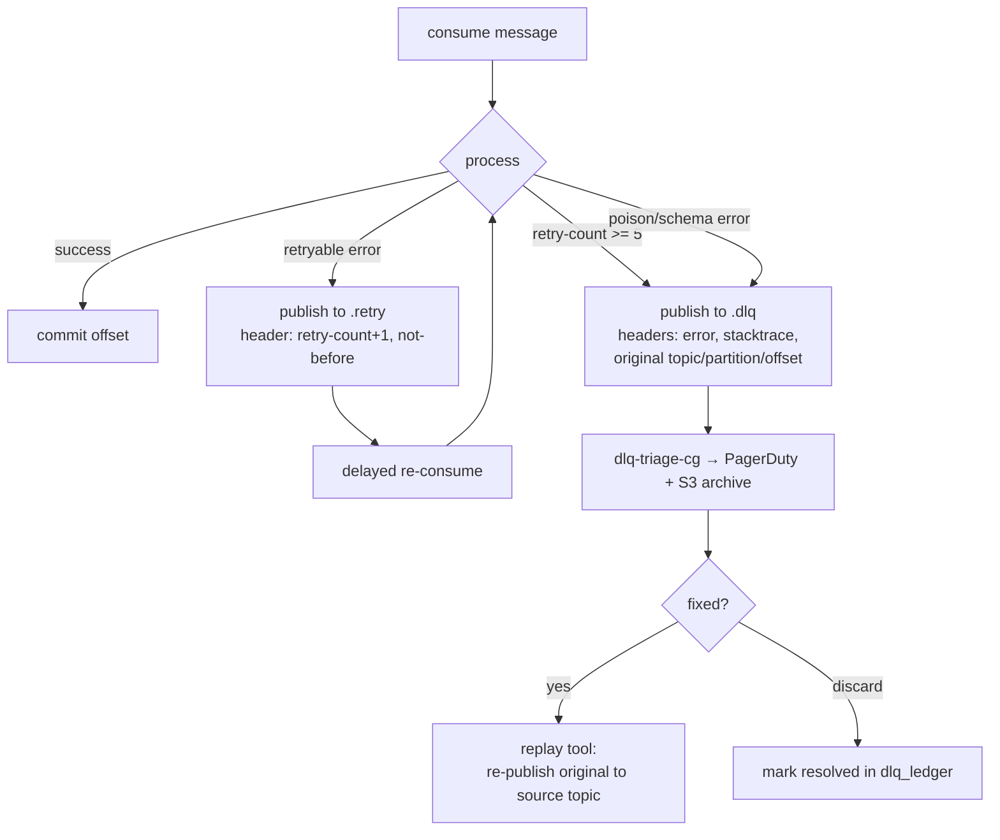

# 03 — Event-Driven Pipeline: Kafka Topology, Schemas, Exactly-Once

> **Extends:** Base Doc §5.1 (`OrderService` Kafka producer/consumer), §I.3 (Event-Driven Architecture), §VI (MSK cluster `greensheet-events`).
> **Fixes:** the **dual-write defect** in Base Doc §5.1 — `createOrder()` commits Postgres *then* calls `producer.send()`; a crash between the two loses `order.created` (inventory never reserved, COF-005 never fires). This document replaces direct sends with the **transactional outbox** and defines the full topology, schemas, and delivery semantics.

---

## 1. Topic Topology

### 1.1 Naming Convention

```
gs.<context>.<entity-stream>.v<schema-major>[.<suffix>]
```

- `context` — bounded context from `01-domain-model-event-storming.md` (`orders`, `catalog`, `crm`, `campaigns`, `samples`, `billing`, `analytics`).
- `entity-stream` — aggregate stream (`events` for lifecycle topics).
- `v1` — bumped only on **incompatible** Avro schema changes (a new topic, not an in-place edit).
- Suffixes: `.retry` (delayed redelivery), `.dlq` (dead letter), `.compact` (compacted changelog topics).

### 1.2 Topology Diagram



### 1.3 Topic Catalogue

| Topic | Producer (via outbox) | Key | Retention | Consumers (group) |
|---|---|---|---|---|
| `gs.orders.events.v1` | Order Service | `orderId` | 7 d / 20 GB | `orders-saga-cg`, `analytics-projector-cg`, `webhook-dispatcher-cg` |
| `gs.catalog.events.v1` | Catalog Service | `lotId` | 7 d | `orders-saga-cg`, `analytics-projector-cg` |
| `gs.samples.events.v1` | Samples Service | `kitId` | 7 d | `campaigns-rule-engine-cg`, `notifications-cg`, `analytics-projector-cg` |
| `gs.campaigns.events.v1` | Campaigns Service | `campaignId` (dispatch events: `roasterId`) | 30 d | `analytics-projector-cg`, `webhook-dispatcher-cg` |
| `gs.crm.events.v1` | CRM Service | `roasterId` | 7 d | `campaigns-rule-engine-cg`, `analytics-projector-cg` |
| `gs.billing.events.v1` | Billing adapter (Stripe webhooks) | `orderId` | 30 d | `orders-saga-cg` |
| `gs.<ctx>.events.v1.retry` | retry producer in each consumer | original key | 1 d | owning consumer group (delayed re-subscription) |
| `gs.<ctx>.events.v1.dlq` | DLQ producer in each consumer | original key | 365 d | `dlq-triage-cg` (ops tooling) |
| `gs.analytics.projections.compact` | Analytics projector | projection name + key | compacted | cache warmers, backfill jobs |

**Partition keys are binding:** all events for one aggregate (`orderId`, `kitId`, `roasterId`) share a partition → per-aggregate ordering, which the saga choreography in `01-domain-model-event-storming.md` §4.5 relies on. Campaign dispatch events are keyed by `roasterId` (not `campaignId`) so that a roaster's COF-001→COF-005 journey is totally ordered.

### 1.4 Broker/Topic Config (applied by Terraform, extends Base Doc §6.1 MSK resource)

```hcl
# terraform/kafka-topics.tf — module: cloud83/topic-management/kafka ~> 0.4
locals {
  topics = {
    "gs.orders.events.v1"    = { partitions = 12, replication = 3, retention_ms = 604800000,  cleanup = "delete" }
    "gs.catalog.events.v1"   = { partitions = 12, replication = 3, retention_ms = 604800000,  cleanup = "delete" }
    "gs.samples.events.v1"   = { partitions = 6,  replication = 3, retention_ms = 604800000,  cleanup = "delete" }
    "gs.campaigns.events.v1" = { partitions = 12, replication = 3, retention_ms = 2592000000, cleanup = "delete" }
    "gs.crm.events.v1"       = { partitions = 6,  replication = 3, retention_ms = 604800000,  cleanup = "delete" }
    "gs.billing.events.v1"   = { partitions = 6,  replication = 3, retention_ms = 2592000000, cleanup = "delete" }
    "gs.analytics.projections.compact" = { partitions = 6, replication = 3, retention_ms = -1, cleanup = "compact" }
  }
}

resource "kafka_topic" "events" {
  for_each           = local.topics
  name               = each.key
  partitions         = each.value.partitions
  replication_factor = each.value.replication
  config = {
    "cleanup.policy"      = each.value.cleanup
    "retention.ms"        = each.value.retention_ms
    "min.insync.replicas" = "2"            # required for acks=all idempotent producers
    "unclean.leader.election.enable" = "false"
    "message.format.version"           = "3.4"
    "compression.type"                 = "producer"
  }
}
```

---

## 2. Event Envelope: CloudEvents 1.0 + Avro Payload

Every message uses **CloudEvents binary mode**: attributes in Kafka headers, Avro-serialized payload as value (magic byte `0x00` + 4-byte schema ID, Confluent wire format). The Schema Registry runs with `BACKWARD_TRANSITIVE` compatibility.

### 2.1 CloudEvents Attribute Mapping

| CloudEvents attr | Kafka header | Example | Notes |
|---|---|---|---|
| `specversion` | `ce_specversion` | `1.0` | constant |
| `id` | `ce_id` | `018f3c2a-…` (UUIDv7) | dedupe key for inbox pattern (§5.3) |
| `type` | `ce_type` | `order.created` | **must match** domain catalogue (§01-6) and `automation_rules.trigger_event` for rule-triggering events |
| `source` | `ce_source` | `//greensheet/orders` | producing service |
| `subject` | `ce_subject` | `/orders/6d2f…` | aggregate URI |
| `time` | `ce_time` | RFC3339 | business occurrence time |
| `datacontenttype` | `content-type` | `application/avro` | |
| `traceparent` | `traceparent` | W3C trace context | continues OpenTelemetry traces (Base Doc §7.1) across the bus |
| `partitionkey` | Kafka record key | `6d2f…` | aggregate ID |
| `idempotencykey` | `ce_idempotencykey` | client key when applicable | propagated from the REST `Idempotency-Key` (§02) |

### 2.2 Avro Schemas (Schema Registry subjects)

Subject naming: `<topic>-value`, e.g. `gs.orders.events.v1-value`. One **union schema per topic**; event-specific records below.

```json
// avro/orders/OrderCreated.avsc — registered under gs.orders.events.v1-value (union member 0)
{
  "type": "record",
  "name": "OrderCreated",
  "namespace": "io.greensheet.events.orders",
  "doc": "Emitted when an Order aggregate is created (Base Doc 5.1 order.created).",
  "fields": [
    { "name": "orderId", "type": { "type": "string", "logicalType": "uuid" } },
    { "name": "accountId", "type": { "type": "string", "logicalType": "uuid" } },
    { "name": "firstOrder", "type": "boolean", "doc": "Drives COF-005 EXECUTE_CAMPAIGN_HALT" },
    { "name": "lineItems", "type": { "type": "array", "items": {
        "type": "record", "name": "OrderLineItem", "fields": [
          { "name": "lotId", "type": { "type": "string", "logicalType": "uuid" } },
          { "name": "quantityLbs", "type": "int" },
          { "name": "unitPriceCents", "type": "int" },
          { "name": "lotBatchNumber", "type": ["null", "string"], "default": null }
        ] } } },
    { "name": "currency", "type": "string", "default": "USD" },
    { "name": "idempotencyKey", "type": ["null", "string"], "default": null },
    { "name": "occurredAt", "type": { "type": "long", "logicalType": "timestamp-millis" } }
  ]
}
```

```json
// avro/samples/SampleKitDelivered.avsc — gs.samples.events.v1-value (union member)
{
  "type": "record",
  "name": "SampleKitDelivered",
  "namespace": "io.greensheet.events.samples",
  "doc": "Pivotal funnel event; CloudEvents type 'sample_kit.delivered' triggers COF-001.",
  "fields": [
    { "name": "kitId", "type": { "type": "string", "logicalType": "uuid" } },
    { "name": "roasterId", "type": { "type": "string", "logicalType": "uuid" } },
    { "name": "deliveredAt", "type": { "type": "long", "logicalType": "timestamp-millis" } },
    { "name": "carrier", "type": ["null", "string"], "default": null },
    { "name": "trackingNumber", "type": ["null", "string"], "default": null },
    { "name": "lotIds", "type": { "type": "array", "items": { "type": "string", "logicalType": "uuid" } } }
  ]
}
```

```json
// avro/campaigns/RuleTriggered.avsc — gs.campaigns.events.v1-value (union member)
{
  "type": "record",
  "name": "RuleTriggered",
  "namespace": "io.greensheet.events.campaigns",
  "fields": [
    { "name": "campaignId", "type": { "type": "string", "logicalType": "uuid" } },
    { "name": "ruleCode", "type": "string", "doc": "COF-001..COF-005 (validated regex ^COF-00[1-9]$)" },
    { "name": "ruleVersion", "type": "int" },
    { "name": "roasterId", "type": { "type": "string", "logicalType": "uuid" } },
    { "name": "triggerEvent", "type": "string", "doc": "e.g. sample_kit.delivered" },
    { "name": "triggerEventId", "type": { "type": "string", "logicalType": "uuid" }, "doc": "CloudEvents id of the triggering event for lineage" },
    { "name": "conditionsMatched", "type": { "type": "map", "values": "string" } },
    { "name": "occurredAt", "type": { "type": "long", "logicalType": "timestamp-millis" } }
  ]
}
```

### 2.3 Schema Evolution Rules (enforced in CI, see `06-testing-chaos-ci.md`)

1. Only additive changes with defaults (`["null", T], default: null`) in v1; anything else → new topic `v2` + dual-publish migration window.
2. `BACKWARD_TRANSITIVE` compatibility checked on PR via Schema Registry mock.
3. Avro → TS types generated by `avro-typescript` into `packages/events/src/gen/`; hand-written event types are forbidden in consumers.

---

## 3. Producer Configuration (Idempotent)

```typescript
// packages/events/src/producer.ts
import { Kafka, Partitioners } from 'kafkajs';

export const kafka = new Kafka({
  clientId: process.env.KAFKA_CLIENT_ID,                 // e.g. 'order-service'
  brokers: (process.env.KAFKA_BROKERS ?? 'localhost:9092').split(','),
  ssl: true,
  sasl: { mechanism: 'oauthbearer', oauthBearerProvider: awsIamOauthProvider }, // MSK IAM auth
});

// Idempotent producer: acks=all, max.in.flight=5, retries=MAX — kafkajs defaults
// when `idempotent: true`; safe against duplicates on retry.
export const producer = kafka.producer({
  idempotent: true,
  maxInFlightRequests: 5,
  transactionalId: undefined,        // plain producers don't need transactions;
  createPartitioner: Partitioners.DefaultPartitioner,
  retry: { retries: 10 },
});
```

---

## 4. Consumer Groups & Processing Semantics

| Consumer group | Topics | Semantics | Why |
|---|---|---|---|
| `orders-saga-cg` | orders, catalog, billing | **Exactly-once** (consume→process→produce in Kafka transaction) | Financial choreography; duplicates = double charges |
| `campaigns-rule-engine-cg` | samples, crm | **Effectively-once** (idempotent inbox, §5.3) | Dispatch dedupe via `campaign_execution_logs` unique key |
| `analytics-projector-cg` | all `*.events.*` | Effectively-once (upsert projections keyed by `ce_id`) | Rebuildable read models |
| `notifications-cg` | samples, crm | At-least-once + provider idempotency keys (SendGrid/Twilio) | External systems |
| `webhook-dispatcher-cg` | orders, samples, campaigns, crm | At-least-once + delivery ledger (§02-7) | Subscribers tolerate duplicates via `Ce-Id` |

### 4.1 Exactly-Once Saga Consumer (consume–transform–produce)

```typescript
// services/orders/saga/OrderSagaConsumer.ts
import { Kafka } from 'kafkajs';
import { v7 as uuidv7 } from 'uuid';

const kafka = new Kafka({ clientId: 'order-saga', brokers: process.env.KAFKA_BROKERS!.split(',') });

// read_committed: we never see aborted transactional messages.
const consumer = kafka.consumer({ groupId: 'orders-saga-cg', readUncommitted: false });
const producer = kafka.producer({
  transactionalId: `orders-saga-${process.env.POD_NAME}`,  // fenced zombie producers
  maxInFlightRequests: 5,
});

export async function runOrderSaga() {
  await consumer.connect();
  await producer.connect();
  await consumer.subscribe({ topics: ['gs.catalog.events.v1', 'gs.billing.events.v1'] });

  await consumer.run({
    autoCommit: false,                                    // offsets move inside the txn
    eachMessage: async ({ topic, partition, message }) => {
      const txn = await producer.transaction();
      try {
        const ce = parseCloudEvent(message);              // headers → attrs
        const payload = decodeAvro(message.value!);       // schema-registry decode

        if (ce.type === 'catalog.inventory_reserved') {
          await authorizePayment(payload.orderId);        // side effect (Stripe)
          await txn.send({
            topic: 'gs.billing.events.v1',
            messages: [{
              key: payload.orderId,
              headers: cloudEventHeaders({
                id: uuidv7(), type: 'billing.payment_authorized',
                source: '//greensheet/billing', subject: `/orders/${payload.orderId}`,
              }),
              value: encodeAvro('PaymentAuthorized', { orderId: payload.orderId, amountCents: payload.amountCents, occurredAt: Date.now() }),
            }],
          });
        }

        if (ce.type === 'billing.payment_failed') {
          await txn.send({
            topic: 'gs.catalog.events.v1',
            messages: [{
              key: payload.lotId,
              headers: cloudEventHeaders({
                id: uuidv7(), type: 'catalog.reservation_released',
                source: '//greensheet/orders', subject: `/lots/${payload.lotId}`,
              }),
              value: encodeAvro('ReservationReleased', payload),
            }],
          });
        }

        // Atomically commit produced messages + consumed offsets.
        await txn.sendOffsets({
          consumerGroupId: 'orders-saga-cg',
          topics: [{ topic, partitions: [{ partition, offset: (Number(message.offset) + 1).toString() }] }],
        });
        await txn.commit();
      } catch (err) {
        await txn.abort();                                // nothing visible downstream
        throw err;                                        // retry/DLQ by wrapper
      }
    },
  });
}
```

**Guarantees:** zombie fencing via stable `transactionalId`; `min.insync.replicas=2` + `acks=all` survives single-broker loss; a crash after DB side-effect (Stripe) but before commit is safe because Stripe calls use idempotency keys derived from `ce_id`.

---

## 5. The Outbox Pattern (Fixes Base Doc §5.1 Dual-Write)

### 5.1 Outbox Table (SQL — applied by migration `20250210_outbox.sql`; see `04-database-evolution.md`)

```sql
-- One outbox per service database (orders, catalog, samples, campaigns, crm).
CREATE TABLE IF NOT EXISTS event_outbox (
    id              UUID        NOT NULL DEFAULT gen_random_uuid(),  -- becomes CloudEvents id
    aggregate_type  TEXT        NOT NULL,                            -- 'order' | 'lot' | 'kit' | ...
    aggregate_id    UUID        NOT NULL,                            -- partition key
    event_type      TEXT        NOT NULL,                            -- 'order.created' (matches ce_type)
    topic           TEXT        NOT NULL,                            -- 'gs.orders.events.v1'
    payload         JSONB       NOT NULL,                            -- serialized Avro-compatible record
    headers         JSONB       NOT NULL DEFAULT '{}'::jsonb,        -- traceparent, idempotencykey
    occurred_at     TIMESTAMPTZ NOT NULL DEFAULT now(),
    published_at    TIMESTAMPTZ,
    publish_attempts INT        NOT NULL DEFAULT 0,
    PRIMARY KEY (id, occurred_at)
) PARTITION BY RANGE (occurred_at);

-- Weekly partitions keep the polling index small; old partitions dropped after publish.
CREATE INDEX IF NOT EXISTS idx_outbox_unpublished
    ON event_outbox (occurred_at)
    WHERE published_at IS NULL;
```

### 5.2 Writing Events — Same Transaction as Domain State

```typescript
// packages/events/src/outbox.ts
import { Knex } from 'knex';
import { v7 as uuidv7 } from 'uuid';

export interface OutboxEvent {
  aggregateType: string;
  aggregateId: string;
  eventType: string;      // e.g. 'order.created'
  topic: string;          // e.g. 'gs.orders.events.v1'
  payload: Record<string, unknown>;
  headers?: Record<string, string>;
}

/** MUST be called with the same trx as the aggregate write. */
export async function appendToOutbox(trx: Knex.Transaction, e: OutboxEvent): Promise<void> {
  await trx('event_outbox').insert({
    id: uuidv7(),
    aggregate_type: e.aggregateType,
    aggregate_id: e.aggregateId,
    event_type: e.eventType,
    topic: e.topic,
    payload: JSON.stringify(e.payload),
    headers: JSON.stringify(e.headers ?? {}),
  });
}
```

`OrderService.createOrder` rewritten (compare Base Doc §5.1):

```typescript
// services/order/OrderService.ts — outbox-corrected version
async createOrder(cmd: CreateOrderCommand): Promise<Order> {
  const order = Order.create(cmd);                       // aggregate enforces invariants
  const trx = await db.transaction();
  try {
    await trx('orders').insert(order.toRow());
    for (const li of order.lineItems) {
      await trx('order_line_items').insert(li.toRow(order.id));
    }
    await trx('audit_logs').insert(AuditLog.created(order).toRow());

    // Same ACID transaction as the state change — no dual write.
    await appendToOutbox(trx, {
      aggregateType: 'order',
      aggregateId: order.id,
      eventType: 'order.created',
      topic: 'gs.orders.events.v1',
      payload: {
        orderId: order.id,
        accountId: order.accountId,
        firstOrder: order.isFirstForAccount,
        lineItems: order.lineItems.map(li => li.toEvent()),
        idempotencyKey: cmd.idempotencyKey,
        occurredAt: Date.now(),
      },
      headers: { traceparent: currentTraceparent(), idempotencykey: cmd.idempotencyKey },
    });

    await trx.commit();
    return order;
  } catch (err) {
    await trx.rollback();
    throw err;
  }
}
```

### 5.3 Outbox Relay (polling publisher, at-least-once to Kafka)

```typescript
// packages/events/src/outbox-relay.ts — one sidecar per service pod (leader-elected)
import { db } from './database';
import { producer } from './producer';
import { encodeAvro } from './schema-registry';

const BATCH = 500;
const POLL_MS = 250;

export async function runOutboxRelay(signal: AbortSignal) {
  while (!signal.aborted) {
    // SKIP LOCKED: multiple relay replicas share work without double-publishing rows
    // (message-level dupes remain possible on crash — consumers dedupe via inbox).
    const rows = await db.raw(`
      UPDATE event_outbox
         SET publish_attempts = publish_attempts + 1
       WHERE id IN (
         SELECT id FROM event_outbox
          WHERE published_at IS NULL
          ORDER BY occurred_at
          LIMIT ?
          FOR UPDATE SKIP LOCKED
       )
      RETURNING id, topic, aggregate_id, event_type, payload, headers, occurred_at
    `, [BATCH]);

    for (const row of rows.rows) {
      try {
        await producer.send({
          topic: row.topic,
          messages: [{
            key: row.aggregate_id,
            value: encodeAvro(row.topic, row.event_type, row.payload),
            headers: {
              ce_specversion: '1.0',
              ce_id: row.id,
              ce_type: row.event_type,
              ce_source: `//greensheet/${process.env.SERVICE_NAME}`,
              ce_subject: `/${row.topic.split('.')[1]}/${row.aggregate_id}`,
              ce_time: new Date(row.occurred_at).toISOString(),
              'content-type': 'application/avro',
              ...(row.headers as Record<string, string>),
            },
          }],
        });
        await db('event_outbox').where('id', row.id).update({ published_at: db.fn.now() });
      } catch (err) {
        // Back off this row; after 25 attempts route to DLQ topic manually via ops runbook.
        if (row.publish_attempts >= 25) await moveToDlq(row, err);
      }
    }

    if (rows.rows.length < BATCH) await sleep(POLL_MS);
  }
}
```

> **CDC alternative:** for high-volume topics (`gs.campaigns.events.v1`) the relay is replaceable by **Debezium Postgres connector** reading `event_outbox` via logical replication (`wal2json`) — zero code change, same table contract. Decision matrix: relay for <2k msg/s, Debezium beyond.

### 5.4 Inbox (Idempotent Consumer) — Effectively-Once Side Effects

```sql
CREATE TABLE IF NOT EXISTS event_inbox (
    consumer_group TEXT NOT NULL,
    event_id       UUID NOT NULL,
    processed_at   TIMESTAMPTZ NOT NULL DEFAULT now(),
    PRIMARY KEY (consumer_group, event_id)
);
```

```typescript
// packages/events/src/inbox.ts
export async function processOnce<T>(
  group: string, eventId: string, handler: (trx: Knex.Transaction) => Promise<T>,
): Promise<{ skipped: boolean; result?: T }> {
  const trx = await db.transaction();
  try {
    const inserted = await trx('event_inbox')
      .insert({ consumer_group: group, event_id: eventId })
      .onConflict(['consumer_group', 'event_id'])
      .ignore();
    if (inserted.length === 0) { await trx.rollback(); return { skipped: true }; }

    const result = await handler(trx);      // business write + inbox row in ONE txn
    await trx.commit();
    return { skipped: false, result };
  } catch (err) {
    await trx.rollback();
    throw err;
  }
}
```

---

## 6. Dead-Letter Handling

### 6.1 Retry & DLQ Flow



- **Retry topics** use a delayed-consumption pattern: consumer pauses partitions until `not-before` header timestamp (implemented with `consumer.pause()`), avoiding busy-spin.
- **DLQ headers (mandatory):** `x-original-topic`, `x-original-partition`, `x-original-offset`, `x-error-class`, `x-error-message`, `x-first-failure-time`, `x-retry-count`.
- **Replay tool:** `scripts/dlq-replay.ts --topic gs.samples.events.v1 --since 2025-03-01 --filter ce_type=sample_kit.delivered` republishes preserving original `ce_id` (so inbox dedupe still protects consumers).

### 6.2 DLQ Triage SLOs

| Metric | Target | Alarm |
|---|---|---|
| DLQ depth (any topic) | 0 sustained; > 10 for 15m | PagerDuty `P2` |
| Oldest unresolved DLQ message | < 24 h | Slack `#ops-events` |
| Retry-topic lag | < 5k | CloudWatch alarm (Base Doc §6.1 pattern) |
| Consumer lag p99 per group | < 30 s | Prometheus `kafka_consumergroup_lag` |

---

## 7. Rule-Engine Consumer (Campaigns) — Reference Implementation

The consumer that turns `sample_kit.delivered` into COF-001 dispatches, closing the loop with the marketing schema's `view_compiled_campaign_rules`:

```typescript
// services/campaigns/RuleEngineConsumer.ts
await consumer.run({
  eachMessage: async ({ message }) => {
    const ce = parseCloudEvent(message);
    await processOnce('campaigns-rule-engine-cg', ce.id, async (trx) => {
      // 1. Load armed rules for this trigger from the compiled view.
      const rules = await trx('view_compiled_campaign_rules')
        .where('trigger_event', ce.type)               // e.g. 'sample_kit.delivered'
        .andWhere('status', 'armed');

      for (const rule of rules) {
        // 2. Evaluate conditions_json against the event payload.
        if (!conditionsMatch(rule.conditions_json, ce.data)) continue;

        // 3. Suppression check (roaster-level opt-out).
        if (await isSuppressed(trx, rule.campaign_id, ce.data.roasterId)) continue;

        // 4. Record trigger + enqueue dispatch (outbox, same txn).
        await trx('campaign_execution_logs').insert({
          id: uuidv7(), campaign_id: rule.campaign_id, rule_id: rule.rule_id,
          rule_version: rule.version, roaster_id: ce.data.roasterId,
          trigger_event_id: ce.id, action_type: rule.action_type,
          status: 'triggered',
        });
        await appendToOutbox(trx, {
          aggregateType: 'campaign', aggregateId: rule.campaign_id,
          eventType: 'campaigns.rule_triggered', topic: 'gs.campaigns.events.v1',
          payload: { campaignId: rule.campaign_id, ruleCode: rule.rule_code,
                     ruleVersion: rule.version, roasterId: ce.data.roasterId,
                     triggerEvent: ce.type, triggerEventId: ce.id, occurredAt: Date.now() },
        });
      }
    });
  },
});
```

---

## 8. Cross-References & Operational Notes

- **Ordering contract:** per-aggregate only (partition key). Campaign sequence ordering across event types (delivered → feedback → click) is guaranteed because all are keyed by `roasterId` within `gs.samples/campaigns` topics consumed by the same group — verified by the chaos experiment `kafka-partition-rebalance` in `06-testing-chaos-ci.md`.
- **Backfill:** new projections bootstrap from the compacted `gs.analytics.projections.compact` changelog plus a one-time Postgres snapshot (`COPY` → replay through projector with synthetic `ce_id = uuidv5(aggregateId)` for idempotence).
- **Cost note:** MSK `kafka.m7g.large ×3` (Base Doc §6.1) sustains ~15 MB/s ingress with the configs above; campaign season peaks (COF blasts) are absorbed by `gs.campaigns.events.v1` 30-day retention buffer.
- **Security:** MSK IAM auth + TLS in transit; topic-level ACLs per service (Catalog produces only `gs.catalog.*`),详见 `07-security-compliance.md` §7.
