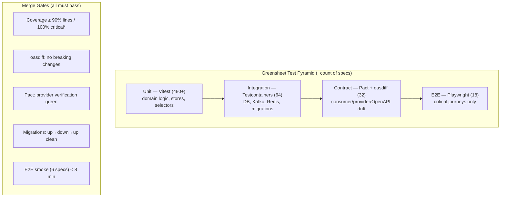

# 06 — Testing Strategy, Chaos Engineering & CI/CD

> **Extends:** Base Doc §VIII (Testing Strategy — Jest/Supertest/Pact), §X (Rollout & Deployment — canary), §XII success criteria ("100% coverage on critical business logic", p95 < 100ms, 99.9% uptime).
> **Upgrades:** Jest → **Vitest** (ESM-native, 5–10× faster with `threads` + Vite transform pipeline shared with the app build); Supertest kept for API integration; Pact retained and wired to the OpenAPI contract (`02-openapi-contract.md`); adds Testcontainers, Playwright, k6, and a chaos program.

---

## 1. Test Pyramid & Coverage Gates



\* *Critical paths (100% required):* `LTVCalculator`, `PricingOptimizer`, `rankLots` selector, outbox append/relay, idempotency middleware, saga compensation handlers, COF rule condition matcher.

```typescript
// vitest.config.ts
import { defineConfig } from 'vitest/config';

export default defineConfig({
  test: {
    pool: 'threads',
    environment: 'node',
    setupFiles: ['./test/setup.ts'],
    coverage: {
      provider: 'v8',
      reporter: ['text', 'lcov', 'json-summary'],
      thresholds: {
        lines: 90, functions: 90, branches: 85, statements: 90,
        perFile: true,
        // 100% on critical business logic (Base Doc §XII success criteria #1)
        'src/services/LTVCalculator.ts':       { lines: 100, branches: 100 },
        'src/services/PricingOptimizer.ts':    { lines: 100, branches: 100 },
        'src/stores/selectors/*.ts':           { lines: 100, branches: 95 },
        'src/lib/idempotency.ts':              { lines: 100, branches: 100 },
        'packages/events/src/outbox*.ts':      { lines: 100, branches: 100 },
        'services/campaigns/conditions.ts':    { lines: 100, branches: 100 },
      },
    },
    projects: [
      { test: { include: ['src/**/*.spec.ts'], name: 'unit' } },
      { test: { include: ['test/integration/**/*.it.ts'], name: 'integration', testTimeout: 60_000 } },
    ],
  },
});
```

---

## 2. Unit Tests (Vitest)

### 2.1 `LTVCalculator` (Base Doc §II.2.1 — financial core)

```typescript
// src/services/__tests__/LTVCalculator.spec.ts
import { describe, it, expect } from 'vitest';
import { calculateDiscountedLTV } from '../LTVCalculator';

describe('calculateDiscountedLTV (Base Doc §II.2.1)', () => {
  it('computes discounted LTV with retention decay', () => {
    const r = calculateDiscountedLTV({
      acquisitionCost: 250, discountRate: 0.10,
      cohortData: [
        { period: 1, retentionRate: 0.85, avgMarginPerLb: 1.50, avgOrderVolume: 500, ordersPerPeriod: 1 },
        { period: 2, retentionRate: 0.78, avgMarginPerLb: 1.55, avgOrderVolume: 550, ordersPerPeriod: 1 },
      ],
    });
    // t=1: 0.85 * (1.5*500) / 1.1 = 579.55 ; t=2: 0.78 * (1.55*550) / 1.21 = 549.42
    expect(r.ltv).toBeCloseTo(1128.97, 1);
    expect(r.netLtv).toBeCloseTo(878.97, 1);
    expect(r.paybackPeriod).toBe(1);
  });

  it('returns full horizon as payback when CAC never recovered', () => {
    const r = calculateDiscountedLTV({
      acquisitionCost: 100_000, discountRate: 0.10,
      cohortData: [
        { period: 1, retentionRate: 0.5, avgMarginPerLb: 0.5, avgOrderVolume: 10, ordersPerPeriod: 1 },
      ],
    });
    expect(r.paybackPeriod).toBe(1);
    expect(r.netLtv).toBeLessThan(0);
  });

  it('LTV/CAC ratio ≥ 3 target (Base Doc §XI KPI) for healthy cohort', () => {
    const r = calculateDiscountedLTV({
      acquisitionCost: 500, discountRate: 0.10,
      cohortData: Array.from({ length: 12 }, (_, t) => ({
        period: t + 1, retentionRate: Math.max(0.4, 0.9 - t * 0.03),
        avgMarginPerLb: 1.6, avgOrderVolume: 550, ordersPerPeriod: 1.2,
      })),
    });
    expect(r.ltv / 500).toBeGreaterThanOrEqual(3);
  });
});
```

### 2.2 COF rule condition matcher (drives `automation_rules.conditions_json`)

```typescript
// services/campaigns/__tests__/conditions.spec.ts
import { describe, it, expect } from 'vitest';
import { conditionsMatch } from '../conditions';

describe('conditionsMatch — marketing schema conditions_json semantics', () => {
  it('COF-001: days_since_delivery equality (number|string coercion)', () => {
    // mirrors SQL: conditions_json ->> 'days_since_delivery' = '4'
    expect(conditionsMatch({ days_since_delivery: 4 }, { daysSinceDelivery: 4 })).toBe(true);
    expect(conditionsMatch({ days_since_delivery: '4' }, { daysSinceDelivery: 4 })).toBe(true);
    expect(conditionsMatch({ days_since_delivery: 4 }, { daysSinceDelivery: 3 })).toBe(false);
  });

  it('COF-002: nested rating threshold', () => {
    expect(conditionsMatch({ 'feedback.rating_gte': 4 }, { feedback: { rating: 5 } })).toBe(true);
    expect(conditionsMatch({ 'feedback.rating_gte': 4 }, { feedback: { rating: 3 } })).toBe(false);
  });

  it('COF-005: first_order boolean', () => {
    expect(conditionsMatch({ first_order: true }, { firstOrder: true })).toBe(true);
    expect(conditionsMatch({ first_order: true }, { firstOrder: false })).toBe(false);
  });

  it('unknown condition keys fail closed (no dispatch)', () => {
    expect(conditionsMatch({ nonexistent_key: 1 }, { daysSinceDelivery: 4 })).toBe(false);
  });
});
```

---

## 3. Integration Tests (Testcontainers)

### 3.1 Migration suite — up → down → up against real Postgres+Timescale

```typescript
// test/integration/migrations.it.ts
import { describe, it, expect, beforeAll, afterAll } from 'vitest';
import { PostgreSqlContainer } from '@testcontainers/postgresql';
import { execSync } from 'node:child_process';
import { Client } from 'pg';

const IMAGE = 'timescale/timescaledb:2.14.2-pg15';

describe('migrations (04-database-evolution.md ledger)', () => {
  let container: Awaited<ReturnType<PostgreSqlContainer['start']>>;
  let pg: Client;

  beforeAll(async () => {
    container = await new PostgreSqlContainer(IMAGE)
      .withDatabase('greensheet').withUsername('gs').withPassword('gs')
      .withCommand(['postgres', '-c', 'shared_preload_libraries=timescaledb'])
      .start();
    pg = new Client({ connectionString: container.getConnectionUri() });
    await pg.connect();
  }, 120_000);

  afterAll(async () => { await pg.end(); await container.stop(); });

  it('applies all migrations up', async () => {
    execSync(`DATABASE_URL=${container.getConnectionUri()} npx node-pg-migrate up`, { stdio: 'inherit' });
    const { rows } = await pg.query(`
      SELECT table_name FROM information_schema.tables
       WHERE table_schema IN ('telemetry','referral','churn','i18n','audit','events')`);
    const names = rows.map((r) => r.table_name);
    expect(names).toContain('engagement_events');
    expect(names).toContain('risk_scores');
    expect(names).toContain('campaign_execution_logs');
    expect(names).toContain('outbox');
  });

  it('creates hypertables with retention policies', async () => {
    const { rows } = await pg.query(`
      SELECT hypertable_name FROM timescaledb_information.hypertables`);
    expect(rows.map((r: any) => r.hypertable_name))
      .toEqual(expect.arrayContaining(['engagement_events', 'risk_scores', 'campaign_execution_logs']));

    const { rows: jobs } = await pg.query(`
      SELECT proc_name FROM timescaledb_information.jobs
       WHERE proc_name IN ('policy_retention','policy_compression')`);
    expect(jobs.length).toBeGreaterThanOrEqual(4);
  });

  it('enforces referral reward uniqueness (double-grant guard)', async () => {
    await pg.query(`INSERT INTO accounts (id, roaster_name) VALUES
      (gen_random_uuid(), 'Ref Co A'), (gen_random_uuid(), 'Ref Co B')`);
    // ... seed code/attribution, then assert UNIQUE(attribution_id, side) rejects second insert
    await expect(pg.query(`
      INSERT INTO referral.rewards (attribution_id, beneficiary_account_id, side, amount_cents)
      SELECT a.id, a.referrer_account_id, 'referrer', 5000 FROM referral.attributions a
      UNION ALL
      SELECT a.id, a.referrer_account_id, 'referrer', 5000 FROM referral.attributions a`))
      .rejects.toThrow(/duplicate key/);
  });

  it('rolls back cleanly (down) and re-applies', async () => {
    execSync(`DATABASE_URL=${container.getConnectionUri()} npx node-pg-migrate down --count 9`, { stdio: 'inherit' });
    execSync(`DATABASE_URL=${container.getConnectionUri()} npx node-pg-migrate up`, { stdio: 'inherit' });
  });
});
```

### 3.2 Outbox relay — no event loss on crash (validates `03-event-driven-pipeline.md` §5)

```typescript
// test/integration/outbox-relay.it.ts
import { describe, it, expect, beforeAll, afterAll } from 'vitest';
import { PostgreSqlContainer } from '@testcontainers/postgresql';
import { KafkaContainer } from '@testcontainers/kafka';
import { Kafka } from 'kafkajs';
import { Client } from 'pg';

describe('outbox relay', () => {
  let pg: Client; let kafka: Kafka; let stop: () => Promise<void>;

  beforeAll(async () => {
    const pgC = await new PostgreSqlContainer('postgres:15').start();
    const kC = await new KafkaContainer().start();
    pg = new Client({ connectionString: pgC.getConnectionUri() });
    await pg.connect();
    kafka = new Kafka({ brokers: [`${kC.getHost()}:${kC.getMappedPort(9093)}`] });
    // ... create events.outbox via migration, start relay against both containers
  }, 180_000);

  it('publishes every committed row exactly once to Kafka', async () => {
    const consumer = kafka.consumer({ groupId: 'test-cg' });
    await consumer.connect();
    await consumer.subscribe({ topic: 'gs.orders.events.v1' });

    const received = new Set<string>();
    await consumer.run({ eachMessage: async ({ message }) => {
      received.add(message.headers!.ce_id!.toString());
    }});

    // Insert 200 outbox rows in 20 concurrent transactions
    await Promise.all(Array.from({ length: 20 }, (_, i) =>
      pg.query(`INSERT INTO events.outbox (aggregate_type, aggregate_id, event_type, topic, payload)
                SELECT 'order', gen_random_uuid(), 'order.created', 'gs.orders.events.v1', '{}'
                  FROM generate_series(1, 10)`)));

    await new Promise((r) => setTimeout(r, 5_000));
    const { rows } = await pg.query(`SELECT count(*)::int AS n FROM events.outbox WHERE published_at IS NOT NULL`);
    expect(rows[0].n).toBe(200);
    expect(received.size).toBe(200);
  });
});
```

### 3.3 API integration — idempotency & error model (Supertest, upgraded from Base Doc §8.2)

```typescript
// test/integration/api-idempotency.it.ts
import { describe, it, expect } from 'vitest';
import request from 'supertest';
import { app } from '../../src/app';

describe('POST /v1/roasters idempotency (02-openapi-contract.md §2)', () => {
  const body = { roasterName: 'Blue Tokai West', primaryContact: { fullName: 'M Rao', email: 'm@example.com', marketingOptIn: true } };

  it('replays same key+body → 200 with Idempotent-Replay', async () => {
    const key = crypto.randomUUID();
    const first = await request(app).post('/v1/roasters')
      .set('Authorization', `Bearer ${testToken()}`).set('Idempotency-Key', key).send(body);
    expect(first.status).toBe(201);

    const replay = await request(app).post('/v1/roasters')
      .set('Authorization', `Bearer ${testToken()}`).set('Idempotency-Key', key).send(body);
    expect(replay.status).toBe(200);
    expect(replay.headers['idempotent-replay']).toBe('true');
    expect(replay.body.id).toBe(first.body.id);
  });

  it('same key + different body → 422 GS-GEN-1003', async () => {
    const key = crypto.randomUUID();
    await request(app).post('/v1/roasters')
      .set('Authorization', `Bearer ${testToken()}`).set('Idempotency-Key', key).send(body);
    const conflict = await request(app).post('/v1/roasters')
      .set('Authorization', `Bearer ${testToken()}`).set('Idempotency-Key', key)
      .send({ ...body, roasterName: 'Different Name' });
    expect(conflict.status).toBe(422);
    expect(conflict.body).toMatchObject({ code: 'GS-GEN-1003', status: 422 });
  });

  it('missing key → 400 GS-GEN-1004 with RFC9457 shape', async () => {
    const res = await request(app).post('/v1/roasters')
      .set('Authorization', `Bearer ${testToken()}`).send(body);
    expect(res.status).toBe(400);
    expect(res.headers['content-type']).toContain('application/problem+json');
    expect(res.body).toMatchObject({ code: 'GS-GEN-1004' });
    expect(res.body.type).toMatch(/^https:\/\/api\.greensheet\.io\/problems\//);
  });
});
```

---

## 4. E2E Tests (Playwright)

```typescript
// e2e/navigator.spec.ts — critical journey: filter → select → reserve
import { test, expect } from '@playwright/test';

test.describe('Origin Navigator (Base Doc §IV.4.2 + Zustand §05)', () => {
  test.beforeEach(async ({ page }) => {
    await page.goto('/navigator');
    await expect(page.getByRole('heading', { name: 'Origin Navigator' })).toBeVisible();
  });

  test('goal selection applies weights and re-ranks lots', async ({ page }) => {
    await page.getByRole('button', { name: /Cost Optimization/ }).click();
    await expect(page.getByText('● Active')).toBeVisible();
    // URL sync (05 §6): goal persists in querystring
    await expect(page).toHaveURL(/goal=costOptimized/);
    const firstCardTitle = page.locator('[data-testid="lot-card"] h3').first();
    await expect(firstCardTitle).toBeVisible();
  });

  test('budget slider filters over-budget lots', async ({ page }) => {
    const slider = page.getByLabel('Budget ceiling slider');
    await slider.fill('6');
    await expect(page.getByText('⚠️ Over Budget')).toHaveCount(0);
    await page.getByLabel('Include out-of-budget lots').check();
    await expect(page.getByText('⚠️ Over Budget').first()).toBeVisible();
  });

  test('reserving a lot decrements availability optimistically', async ({ page }) => {
    const card = page.locator('[data-testid="lot-card"]').first();
    const before = await card.locator('[data-testid="available-lbs"]').innerText();
    await card.getByRole('button', { name: 'Source This Lot' }).click();
    await expect(page.getByText('Lot reserved for 30 minutes.')).toBeVisible();
    const after = await card.locator('[data-testid="available-lbs"]').innerText();
    expect(Number(after.replace(/\D/g, ''))).toBeLessThan(Number(before.replace(/\D/g, '')));
  });

  test('share link restores filters (URL sync)', async ({ page }) => {
    await page.goto('/navigator?goal=qualityFirst&minCup=88&origins=Ethiopia');
    await expect(page.getByRole('button', { name: /Quality Focus/ })).toContainText('● Active');
    for (const card of await page.locator('[data-testid="lot-card"]').all()) {
      await expect(card.locator('h3')).toContainText('Ethiopia');
    }
  });
});
```

```typescript
// e2e/campaign-intelligence.spec.ts — COF funnel + A/B panel
import { test, expect } from '@playwright/test';

test('Campaign Intelligence renders COF sequence and Bayesian A/B table', async ({ page }) => {
  await page.goto('/campaigns/cof-nurture-2025');
  await expect(page.getByRole('heading', { name: /Campaign Details|Touch/ })).toBeVisible();
  await expect(page.getByText('Multivariate Performance Analysis')).toBeVisible();
  await expect(page.getByRole('cell', { name: 'subject_variant_a' })).toBeVisible();
  await page.getByRole('button', { name: /Step 2/ }).click();          // activeStep via campaign slice
  await expect(page.getByText(/Touch 2/)).toBeVisible();
});
```

```typescript
// playwright.config.ts
import { defineConfig } from '@playwright/test';
export default defineConfig({
  testDir: './e2e',
  retries: process.env.CI ? 2 : 0,
  workers: process.env.CI ? 4 : undefined,
  use: {
    baseURL: process.env.E2E_BASE_URL ?? 'http://localhost:5173',
    trace: 'retain-on-failure',
    screenshot: 'only-on-failure',
  },
  webServer: process.env.CI ? undefined : { command: 'pnpm dev', port: 5173, reuseExistingServer: true },
});
```

---

## 5. Contract Testing (Pact, V3)

Consumer tests produce pacts; the provider verifies them against a running instance seeded from the marketing schema's COF seed data — closing the loop with `02-openapi-contract.md`.

```typescript
// test/contract/roasters.pact.ts — consumer: greensheet-web
import { describe, it, expect } from 'vitest';
import { PactV3, MatchersV3 } from '@pact-foundation/pact';
import { apiClient } from '../../src/lib/api-client';

const { like, integer, uuid, string } = MatchersV3;

const provider = new PactV3({
  consumer: 'greensheet-web',
  provider: 'greensheet-api',
  dir: './pacts',
  logLevel: 'warn',
});

describe('greensheet-web → greensheet-api contract', () => {
  it('GET /v1/roasters/{id}/churn-risk returns RFC9457-aware shape', () => {
    return provider
      .addInteraction({
        state: 'roaster 9b1 has a churn risk score above threshold',
        uponReceiving: 'a request for churn risk',
        withRequest: { method: 'GET', path: '/v1/roasters/9b1/churn-risk' },
        willRespondWith: {
          status: 200,
          headers: { 'Content-Type': 'application/json' },
          body: {
            roasterId: uuid('9b1'),
            riskScore: like(0.82),
            threshold: like(0.7),
            modelVersion: string('coxph-2025.05'),
            topFeatures: like([{ feature: string('days_since_last_activity'), contribution: like(0.41) }]),
            scoredAt: string('2025-02-10T09:00:00Z'),
          },
        },
      })
      .executeTest(async (mock) => {
        const res = await apiClient(mock.url).get('/v1/roasters/9b1/churn-risk');
        expect(res.riskScore).toBeGreaterThanOrEqual(0.7);
      });
  });

  it('POST /v1/roasters without Idempotency-Key → GS-GEN-1004 problem', () => {
    return provider
      .addInteraction({
        state: 'any',
        uponReceiving: 'a create request without idempotency key',
        withRequest: {
          method: 'POST', path: '/v1/roasters',
          headers: { 'Content-Type': 'application/json' },
          body: { roasterName: string('X'), primaryContact: like({}) },
        },
        willRespondWith: {
          status: 400,
          headers: { 'Content-Type': 'application/problem+json' },
          body: { type: like('https://api.greensheet.io/problems/GS-GEN-1004'),
                  title: string('Idempotency key required'),
                  status: integer(400), code: 'GS-GEN-1004' },
        },
      })
      .executeTest(async (mock) => {
        await expect(apiClient(mock.url).post('/v1/roasters', { roasterName: 'X', primaryContact: {} }))
          .rejects.toMatchObject({ problem: { code: 'GS-GEN-1004' } });
      });
  });
});
```

```typescript
// test/contract/provider.verify.ts — provider side (runs in CI against ephemeral env)
import { Verifier } from '@pact-foundation/pact';
import { execSync } from 'node:child_process';

async function verify() {
  execSync('npx node-pg-migrate up');                 // full schema (04 ledger)
  execSync('psql $DATABASE_URL -f seeds/cof-001-005.sql');  // marketing schema seed
  execSync('psql $DATABASE_URL -f test/contract/provider-states.sql'); // states below

  const result = await new Verifier({
    provider: 'greensheet-api',
    providerBaseUrl: process.env.API_URL ?? 'http://localhost:3000',
    pactUrls: ['./pacts'],
    publishVerificationResult: process.env.CI === 'true',
    providerVersion: process.env.GITHUB_SHA,
    stateHandlers: {
      'roaster 9b1 has a churn risk score above threshold': async () => {
        execSync(`psql $DATABASE_URL -c "
          INSERT INTO churn.risk_scores (account_id, model_version, risk_score, features)
          VALUES ('9b1', 'coxph-2025.05', 0.82, '{}') ON CONFLICT DO NOTHING"`);
      },
    },
  }).verifyProvider();
  console.log('Pact verification:', result);
}
void verify();
```

**OpenAPI drift gate:** `oasdiff breaking api/openapi/greensheet-v1.prev.yaml api/openapi/greensheet-v1.yaml --fail-on ERR` runs on every PR (see §7 `api-contract` job).

---

## 6. Chaos Engineering Program

Steady-state hypothesis for every experiment: **p95 API latency < 100ms, 5xx < 0.1%, consumer lag < 30s, zero event loss** (Base Doc §XII success criteria). Blast radius limited to staging; production game-days run quarterly on the canary cell only.

### 6.1 Experiment catalogue

| # | Experiment | Tool | Hypothesis being tested | Abort condition |
|---|---|---|---|---|
| CH-01 | Kill 1 of 3 MSK brokers (10 min) | AWS FIS | producers keep acks=all via min.insync.replicas=2; outbox lag < 5k | lag > 20k |
| CH-02 | RDS failover (`reboot --force-failover`) | AWS FIS | p95 recovers < 90s; HikariCP/pgbouncer reconnects; no outbox loss | any outbox row unpublished > 5m |
| CH-03 | Redis eviction storm (FLUSHALL) | Chaos Mesh `RedisChaos` | idempotency middleware degrades to fail-closed `503` w/ `GS-GEN-1007`, zero duplicate charges | duplicate order detected |
| CH-04 | 300ms egress latency to SendGrid/Twilio | Chaos Mesh `NetworkChaos` | dispatch retries w/ backoff; no double-send (ledger idempotency key) | duplicate provider_ref |
| CH-05 | Kafka consumer partition rebalance storm | Chaos Mesh `PodChaos` (kill consumer pods) | per-aggregate ordering preserved; no COF double-dispatch | duplicate dispatch in ledger |
| CH-06 | AZ loss (subnet blackhole) | AWS FIS network ACL | ALB routes around; error rate < 0.1% | SLO burn > 2%/min |
| CH-07 | Canary pod CPU throttle 90% | Chaos Mesh `StressChaos` | canary analysis aborts & rolls back (§7 cd.yml) | rollback fails to trigger |

### 6.2 Chaos Mesh manifests (staging)

```yaml
# chaos/ch-04-egress-latency.yaml
apiVersion: chaos-mesh.org/v1alpha1
kind: NetworkChaos
metadata:
  name: ch-04-egress-latency
  namespace: greensheet-staging
spec:
  action: delay
  mode: all
  selector:
    namespaces: [greensheet-staging]
    labelSelectors:
      app: campaigns-service
  delay:
    latency: 300ms
    jitter: 50ms
  direction: to
  externalTargets: ["api.sendgrid.com", "api.twilio.com"]
  duration: "10m"
---
# chaos/ch-05-consumer-kill.yaml
apiVersion: chaos-mesh.org/v1alpha1
kind: PodChaos
metadata:
  name: ch-05-consumer-kill
  namespace: greensheet-staging
spec:
  action: pod-kill
  mode: one
  selector:
    namespaces: [greensheet-staging]
    labelSelectors:
      app: campaigns-rule-engine
  gracePeriod: 0
  duration: "15m"          # repeated kills throughout the window
```

### 6.3 AWS FIS template (broker kill)

```json
// fis/ch-01-msk-broker-kill.json
{
  "description": "CH-01: terminate one MSK broker; verify outbox continuity",
  "targets": {
    "broker": {
      "resourceType": "aws:msk:cluster",
      "resourceArns": ["arn:aws:kafka:us-west-2:ACCT:cluster/greensheet-events-staging/*"],
      "selectionMode": "COUNT(1)"
    }
  },
  "actions": {
    "terminateBroker": {
      "actionId": "aws:msk:terminate-broker",
      "parameters": { "duration": "PT10M" },
      "targets": { "Cluster": "broker" }
    }
  },
  "stopConditions": [{ "source": "aws:cloudwatch:alarm", "value": "arn:aws:cloudwatch:us-west-2:ACCT:alarm:chaos-abort-outbox-lag" }],
  "roleArn": "arn:aws:iam::ACCT:role/fis-chaos-role",
  "tags": { "experiment": "CH-01" }
}
```

### 6.4 Game-day runbook (quarterly)

1. **T-24h:** announce in `#ops-events`; freeze deploys on staging; snapshot dashboards (baseline p95/lag).
2. **T-0:** start steady-state monitor (`k6 chaos-watch.js`, 200 RPS canary traffic) → run experiment manifest.
3. **During:** observer records first-detection time (MTTD) and recovery time (MTTR); abort on stop condition.
4. **T+1h:** verify zero data loss — `SELECT count(*) FROM events.outbox WHERE published_at IS NULL` → 0; DLQ depth 0.
5. **T+24h:** blameless retro; file corrective actions as P1 backlog; update this catalogue.

---

## 7. Load Testing (k6) — Performance Gate

```javascript
// perf/lots-search.k6.js — models Navigator usage; gate: p95 < 100ms (Base Doc §XII #2)
import http from 'k6/http';
import { check, sleep } from 'k6';
import { Trend, Rate } from 'k6/metrics';

const p95 = new Trend('lots_latency', true);
const errRate = new Rate('errors');

export const options = {
  scenarios: {
    ramp: {
      executor: 'ramping-vus',
      stages: [
        { duration: '2m', target: 50 },   // warm
        { duration: '5m', target: 300 },  // expected peak (COF blast day)
        { duration: '2m', target: 600 },  // 2x peak
        { duration: '3m', target: 0 },
      ],
    },
  },
  thresholds: {
    http_req_duration: ['p(95)<100'],     // hard gate — fails CI
    errors: ['rate<0.001'],
  },
};

const ORIGINS = ['Ethiopia', 'Colombia', 'Guatemala', 'Kenya', 'Sumatra'];

export default function () {
  const origin = ORIGINS[Math.floor(Math.random() * ORIGINS.length)];
  const res = http.get(
    `${__ENV.API_URL}/v1/catalog/lots?origins=${origin}&minCupScore=85&limit=25`,
    { headers: { Authorization: `Bearer ${__ENV.TOKEN}` } },
  );
  p95.add(res.timings.duration);
  errRate.add(res.status !== 200);
  check(res, {
    '200': (r) => r.status === 200,
    'has page info': (r) => r.json('page.hasMore') !== undefined,
  });
  sleep(0.3);
}
```

---

## 8. CI/CD — GitHub Actions

### 8.1 `ci.yml` — build, test, migrate, contract

```yaml
# .github/workflows/ci.yml
name: ci
on:
  pull_request:
  push:
    branches: [main]

concurrency:
  group: ci-${{ github.ref }}
  cancel-in-progress: true

env:
  NODE_VERSION: '20'

jobs:
  lint-typecheck:
    runs-on: ubuntu-latest
    steps:
      - uses: actions/checkout@v4
      - uses: pnpm/action-setup@v3
        with: { version: 9 }
      - uses: actions/setup-node@v4
        with:
          node-version: ${{ env.NODE_VERSION }}
          cache: pnpm
      - run: pnpm install --frozen-lockfile
      - run: pnpm lint && pnpm typecheck
      - run: pnpm exec vacuum lint api/openapi/greensheet-v1.yaml -d   # OpenAPI lint

  unit:
    runs-on: ubuntu-latest
    needs: lint-typecheck
    steps:
      - uses: actions/checkout@v4
      - uses: pnpm/action-setup@v3
        with: { version: 9 }
      - uses: actions/setup-node@v4
        with:
          node-version: ${{ env.NODE_VERSION }}
          cache: pnpm
      - run: pnpm install --frozen-lockfile
      - run: pnpm vitest run --project unit --coverage
      - uses: actions/upload-artifact@v4
        with: { name: coverage, path: coverage/ }
      - name: Enforce coverage gates
        run: node scripts/check-coverage.mjs coverage/coverage-summary.json

  api-contract:
    runs-on: ubuntu-latest
    steps:
      - uses: actions/checkout@v4
        with: { fetch-depth: 0 }
      - name: Breaking-change detection (02-openapi-contract.md §8)
        run: |
          git show origin/main:api/openapi/greensheet-v1.yaml > /tmp/prev.yaml || touch /tmp/prev.yaml
          pnpm dlx oasdiff breaking /tmp/prev.yaml api/openapi/greensheet-v1.yaml --fail-on ERR
      - name: Avro compatibility (03-event-driven-pipeline.md §2.3)
        run: pnpm exec ts-node scripts/check-avro-compat.ts --registry $SCHEMA_REGISTRY_MOCK

  integration:
    runs-on: ubuntu-latest
    needs: unit
    steps:
      - uses: actions/checkout@v4
      - uses: pnpm/action-setup@v3
        with: { version: 9 }
      - uses: actions/setup-node@v4
        with:
          node-version: ${{ env.NODE_VERSION }}
          cache: pnpm
      - run: pnpm install --frozen-lockfile
      # Testcontainers spins timescaledb + redpanda from §3 suites
      - run: pnpm vitest run --project integration
        env:
          TESTCONTAINERS_RYUK_DISABLED: 'false'
          DOCKER_HOST: unix:///var/run/docker.sock

  pact:
    runs-on: ubuntu-latest
    needs: integration
    services:
      # -ha image preloads timescaledb via shared_preload_libraries by default
      postgres:
        image: timescale/timescaledb-ha:pg15-latest
        env: { POSTGRES_DB: greensheet, POSTGRES_USER: gs, POSTGRES_PASSWORD: gs }
        ports: ['5432:5432']
        options: >-
          --health-cmd "pg_isready -U gs -d greensheet"
          --health-interval 5s --health-timeout 3s --health-retries 10
    steps:
      - uses: actions/checkout@v4
      - uses: pnpm/action-setup@v3
        with: { version: 9 }
      - uses: actions/setup-node@v4
        with:
          node-version: ${{ env.NODE_VERSION }}
          cache: pnpm
      - run: pnpm install --frozen-lockfile
      - run: pnpm vitest run test/contract --dir test/contract       # consumer pacts
      - run: pnpm start:test &                                       # boot API
      - run: pnpm ts-node test/contract/provider.verify.ts
        env:
          DATABASE_URL: postgres://gs:gs@localhost:5432/greensheet
          CI: 'true'
          GITHUB_SHA: ${{ github.sha }}

  e2e:
    runs-on: ubuntu-latest
    needs: pact
    steps:
      - uses: actions/checkout@v4
      - uses: pnpm/action-setup@v3
        with: { version: 9 }
      - uses: actions/setup-node@v4
        with:
          node-version: ${{ env.NODE_VERSION }}
          cache: pnpm
      - run: pnpm install --frozen-lockfile
      - run: pnpm playwright install --with-deps chromium
      - run: pnpm build && pnpm start:test & sleep 10 && pnpm playwright test --grep @smoke
      - uses: actions/upload-artifact@v4
        if: failure()
        with: { name: playwright-report, path: playwright-report/ }

  build-push:
    runs-on: ubuntu-latest
    needs: e2e
    if: github.ref == 'refs/heads/main'
    outputs:
      image: ${{ steps.meta.outputs.image }}
    steps:
      - uses: actions/checkout@v4
      - uses: aws-actions/configure-aws-credentials@v4
        with:
          role-to-assume: arn:aws:iam::${{ secrets.AWS_ACCOUNT_ID }}:role/gh-actions-ecr
          aws-region: us-west-2
      - uses: aws-actions/amazon-ecr-login@v2
        id: ecr
      - id: meta
        run: echo "image=${{ steps.ecr.outputs.registry }}/greensheet-api:${{ github.sha }}" >> "$GITHUB_OUTPUT"
      - run: |
          docker build -t ${{ steps.meta.outputs.image }} \
            --label org.opencontainers.image.revision=${{ github.sha }} .
          docker push ${{ steps.meta.outputs.image }}

  perf-gate:
    runs-on: ubuntu-latest
    needs: build-push
    if: github.ref == 'refs/heads/main'
    steps:
      - uses: actions/checkout@v4
      - uses: grafana/k6-action@v0.3.1
        with:
          filename: perf/lots-search.k6.js
        env:
          API_URL: https://api.staging.greensheet.io
          TOKEN: ${{ secrets.K6_TEST_TOKEN }}
```

### 8.2 `cd.yml` — migrate → canary → promote (extends Base Doc §10.2)

```yaml
# .github/workflows/cd.yml
name: cd
on:
  workflow_run:
    workflows: [ci]
    branches: [main]
    types: [completed]

concurrency: production-deploy   # serialize prod deploys

jobs:
  migrate:
    if: ${{ github.event.workflow_run.conclusion == 'success' }}
    runs-on: ubuntu-latest
    environment: production
    steps:
      - uses: actions/checkout@v4
      - name: Pre-flight — retention/jobs healthy (04 §11)
        run: psql $DATABASE_URL -f scripts/db-preflight.sql
        env:
          DATABASE_URL: ${{ secrets.PROD_DATABASE_URL }}
      - name: Expand-phase migrations (backward-compatible only)
        run: npx node-pg-migrate up --check-order
        env:
          DATABASE_URL: ${{ secrets.PROD_DATABASE_URL }}
      - name: Rollback on failure
        if: failure()
        run: npx node-pg-migrate down --count 1
        env:
          DATABASE_URL: ${{ secrets.PROD_DATABASE_URL }}

  deploy-canary:
    needs: migrate
    runs-on: ubuntu-latest
    environment: production
    steps:
      - uses: aws-actions/configure-aws-credentials@v4
        with:
          role-to-assume: arn:aws:iam::${{ secrets.AWS_ACCOUNT_ID }}:role/gh-actions-ecs
          aws-region: us-west-2
      - name: Register canary task def (5% traffic)
        run: |
          aws ecs register-task-definition \
            --family greensheet-api-canary \
            --cli-input-json file://deploy/taskdef.canary.json
          aws ecs update-service --cluster greensheet-cluster \
            --service greensheet-api-canary \
            --task-definition greensheet-api-canary --desired-count 1
      - name: Set ALB weighted routing 95/5
        run: |
          aws elbv2 modify-listener --listener-arn ${{ secrets.ALB_LISTENER_ARN }} \
            --default-actions file://deploy/weights.95-5.json

  canary-analysis:
    needs: deploy-canary
    runs-on: ubuntu-latest
    steps:
      - name: Observe canary (10 min) — error rate & latency & outbox lag
        run: |
          node scripts/canary-analyze.mjs \
            --duration 600 \
            --max-error-rate 0.01 \
            --max-p95-ms 100 \
            --max-outbox-lag 5000
      - name: Rollback canary on breach
        if: failure()
        run: |
          aws elbv2 modify-listener --listener-arn ${{ secrets.ALB_LISTENER_ARN }} \
            --default-actions file://deploy/weights.100-0.json
          aws ecs update-service --cluster greensheet-cluster \
            --service greensheet-api-canary --desired-count 0
          exit 1

  promote:
    needs: canary-analysis
    runs-on: ubuntu-latest
    environment: production
    steps:
      - name: Progressive rollout 5% → 25% → 50% → 100%
        run: |
          for W in 25 50 100; do
            sed "s/CANARY_WEIGHT/$W/" deploy/weights.template.json > /tmp/w.json
            aws elbv2 modify-listener --listener-arn ${{ secrets.ALB_LISTENER_ARN }} \
              --default-actions file:///tmp/w.json
            node scripts/canary-analyze.mjs --duration 300 --max-error-rate 0.01 --max-p95-ms 100
          done
      - name: Contract-phase migrations (post-soak, gated)
        if: github.event.inputs.run_contract_phase == 'true'
        run: npx node-pg-migrate up --only-contract
        env:
          DATABASE_URL: ${{ secrets.PROD_DATABASE_URL }}
      - name: Slack notify
        uses: slackapi/slack-github-action@v1
        with:
          payload: '{"text": "greensheet-api ${{ github.sha }} promoted to 100%"}'
        env:
          SLACK_WEBHOOK_URL: ${{ secrets.SLACK_WEBHOOK }}
```

### 8.3 `chaos-nightly.yml` — scheduled resilience verification

```yaml
# .github/workflows/chaos-nightly.yml
name: chaos-nightly
on:
  schedule: [{ cron: '0 3 * * 1-5' }]   # 03:00 UTC, matches RDS backup window end
  workflow_dispatch:

jobs:
  chaos:
    runs-on: ubuntu-latest
    environment: staging
    strategy:
      fail-fast: false
      matrix:
        experiment: [ch-01-msk-broker-kill, ch-04-egress-latency, ch-05-consumer-kill]
    steps:
      - uses: actions/checkout@v4
      - name: Apply experiment
        run: kubectl apply -f chaos/${{ matrix.experiment }}.yaml
      - name: Steady-state probe (k6)
        run: k6 run --duration 12m perf/chaos-watch.js
      - name: Verify zero event loss
        run: |
          UNPUBLISHED=$(psql $STAGING_DATABASE_URL -tAc \
            "SELECT count(*) FROM events.outbox WHERE published_at IS NULL AND occurred_at < now() - interval '5 min'")
          test "$UNPUBLISHED" -eq 0
        env:
          STAGING_DATABASE_URL: ${{ secrets.STAGING_DATABASE_URL }}
      - name: Cleanup
        if: always()
        run: kubectl delete -f chaos/${{ matrix.experiment }}.yaml --ignore-not-found
```

---

## 9. Quality Dashboard (feeds Base Doc §XI KPIs)

| Signal | Source | Target |
|---|---|---|
| Unit/integration pass rate | CI | 100% required |
| Coverage on critical paths | Vitest V8 | 100% (§1) |
| Pact verification | Pact Broker | green on every provider SHA |
| Canary abort rate | `canary-analyze.mjs` logs | < 5% of deploys |
| Chaos MTTD / MTTR | game-day log | < 2 min / < 15 min |
| k6 p95 gate | perf-gate job | < 100ms sustained at 2× peak |
| DLQ depth post-chaos | `chaos-nightly` | 0 |
