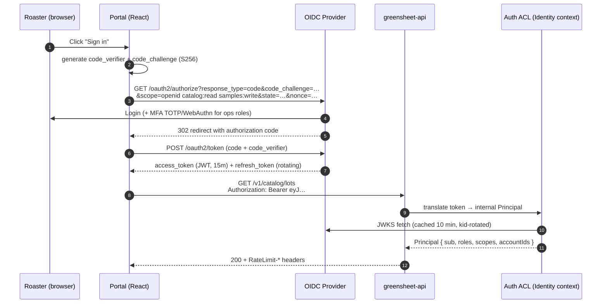

# 07 — Security & Compliance Architecture

> **Extends:** Base Doc §6.1 (Terraform security groups, Secrets Manager injection), §7.2 (log redaction), §I.3 (Auth Service). Aligns the platform with **SOC 2 Type II** trust criteria and **GDPR/CCPA** obligations for roaster PII, and supplies the enforcement code for the API contract's security schemes (`02-openapi-contract.md` §5).

---

## 1. Authentication (AuthN) — OIDC

Greensheet runs an **OIDC Provider** (Keycloak or AWS Cognito; issuer `https://auth.greensheet.io`) with two grant patterns:

- **Humans (roaster portal + internal ops):** Authorization Code + **PKCE** (S256), short-lived access tokens (15 min) + rotating refresh tokens (8 h absolute, reuse detection on).
- **Machines (saga participants, CI, partners):** `client_credentials` with **private_key_jwt** client assertion; internal service calls additionally bound to **mTLS** at the ALB/NLB (certificate SAN allow-list) — the `serviceAccount` security scheme in the OpenAPI contract.



**Access-token claims (binding):**

```json
{
  "iss": "https://auth.greensheet.io",
  "sub": "usr_01H…",
  "aud": "greensheet-api",
  "exp": 1739200000,
  "iat": 1739199100,
  "jti": "01J…",
  "scope": "openid catalog:read samples:write",
  "gs_roles": ["roaster_buyer"],
  "gs_account_ids": ["6d2f…"],
  "gs_segment": "boutique"
}
```

**Token validation middleware:**

```typescript
// src/lib/authn.ts
import { createRemoteJWKSet, jwtVerify, type JWTPayload } from 'jose';

const JWKS = createRemoteJWKSet(new URL('https://auth.greensheet.io/.well-known/jwks.json'), {
  cacheMaxAge: 600_000,
});

export interface Principal {
  subject: string;
  roles: string[];
  scopes: Set<string>;
  accountIds: string[];
  segment?: string;
  jti: string;
}

export async function authenticate(authHeader?: string): Promise<Principal> {
  if (!authHeader?.startsWith('Bearer ')) throw problem(401, 'GS-GEN-1001', 'Unauthenticated');
  const { payload } = await jwtVerify(authHeader.slice(7), JWKS, {
    issuer: 'https://auth.greensheet.io',
    audience: 'greensheet-api',
    clockTolerance: 30,
  });
  return toPrincipal(payload);
}

function toPrincipal(p: JWTPayload): Principal {
  return {
    subject: p.sub!,
    roles: (p.gs_roles as string[]) ?? [],
    scopes: new Set(((p.scope as string) ?? '').split(' ').filter(Boolean)),
    accountIds: (p.gs_account_ids as string[]) ?? [],
    segment: p.gs_segment as string | undefined,
    jti: p.jti!,
  };
}
```

**Session hardening:** refresh-token reuse revokes the whole family (RTR); ops roles require MFA (TOTP minimum, WebAuthn preferred); `gs_account_ids` binds roaster-portal tokens to specific roaster accounts so a stolen buyer token can't enumerate other roasters (object-level authorization, BOLA/OWASP API#1).

---

## 2. Authorization (AuthZ) — RBAC Matrix

Roles map 1:1 to OAuth scopes from `02-openapi-contract.md` §5. Enforcement is **deny-by-default** at the route layer plus **resource-level scoping** in the service layer.

| Permission / Scope | `platform_admin` | `ops_manager` | `sales_csm` | `analyst` | `roaster_buyer` | `svc_*` (machine) |
|---|---|---|---|---|---|---|
| `roasters:read` | ✅ all | ✅ all | ✅ assigned book | ✅ aggregate only (no PII) | ✅ own org only | `svc_campaigns`, `svc_orders` (no PII cols) |
| `roasters:write` | ✅ | ✅ | ✅ (no status→churned) | ❌ | ✅ own profile | `svc_orders` (create from checkout) |
| `catalog:read` | ✅ | ✅ | ✅ | ✅ | ✅ | all svc |
| `catalog:write` | ✅ | ✅ | ❌ | ❌ | ❌ (reservations only) | `svc_catalog` |
| `campaigns:read` | ✅ | ✅ | ✅ | ✅ | ❌ | `svc_notify` (compiled view only) |
| `campaigns:write` | ✅ | ✅ | ✅ (no halt) | ❌ | ❌ | `svc_campaigns` |
| `samples:read` | ✅ | ✅ | ✅ | ✅ | ✅ own kits | `svc_campaigns` |
| `samples:write` | ✅ | ✅ | ✅ | ❌ | ✅ (max 2 active — invariant §01) | ❌ |
| `analytics:read` | ✅ | ✅ | ✅ | ✅ | ❌ | `svc_analytics` |
| `webhooks:manage` | ✅ | ✅ | ❌ | ❌ | ✅ own endpoints | ❌ |
| PII columns (`contacts.*`) | ✅ | ✅ | ✅ assigned | ❌ | ✅ own | ❌ (revoked, `04-database-evolution.md` §10) |
| Churn risk scores | ✅ | ✅ | ✅ | ✅ | ❌ (not exposed to subject) | `svc_analytics` |
| Audit ledgers (read) | ✅ | ❌ | ❌ | ❌ | ❌ | `svc_analytics` |
| Feature flags (`FeatureFlag.*`, Base Doc §10.1) | ✅ | ✅ (rollout %) | ❌ | ❌ | ❌ | ❌ |

**Enforcement middleware:**

```typescript
// src/lib/authz.ts
import type { Principal } from './authn';

export function requireScope(scope: string) {
  return (req: AuthedRequest, res: Response, next: NextFunction) => {
    if (!req.principal.scopes.has(scope)) {
      auditDeny(req, scope);                                   // → §8 audit trail
      throw problem(403, 'GS-GEN-1002', `Missing scope ${scope}`);
    }
    next();
  };
}

/** BOLA guard: roaster-portal tokens may only touch their own accounts. */
export function scopedToAccount(param = 'roasterId') {
  return (req: AuthedRequest, _res: Response, next: NextFunction) => {
    const p: Principal = req.principal;
    if (p.roles.includes('platform_admin') || p.roles.includes('ops_manager')) return next();
    const id = req.params[param];
    if (id && !p.accountIds.includes(id)) {
      auditDeny(req, `account:${id}`);
      // 404 not 403 — do not leak existence of other tenants' resources
      throw problem(404, 'GS-GEN-1005', 'Resource not found');
    }
    next();
  };
}

// Route wiring example (matches OpenAPI security):
// app.get('/v1/roasters/:roasterId/churn-risk',
//   authn, requireScope('analytics:read'), scopedToAccount('roasterId'), getChurnRisk);
```

**ABAC notes:** segment-targeted features (`FeatureFlag.PredictivePricing` → `targetSegments: ['enterprise']`, Base Doc §10.1) evaluate `principal.segment` at runtime; data-level ABAC (e.g., CSM book-of-business) is enforced by a `sales_assignments(account_id, user_id)` table joined in every CRM query — never by client-supplied filters.

---

## 3. SOC 2 Type II Control Mapping

| TSC criterion | Control | Greensheet implementation | Evidence artifact |
|---|---|---|---|
| **CC6.1** Logical access | Least-privilege RBAC, SSO+MFA, quarterly access review | §1–2; DB roles (`04 §10`); IdP group→role mapping | Access review tickets; IdP audit log export |
| **CC6.2** Provisioning | Joiner/mover/leaver via HRIS → IdP SCIM; machine creds via Terraform | SCIM deprovisioning < 1h; no shared accounts | Terraform plan history |
| **CC6.3** Network | VPC private subnets for RDS/Redis/MSK (Base Doc §6.1 SGs), ALB-only ingress, mTLS east-west | §1; Terraform SGs | Config rules (AWS Config) |
| **CC6.6** Boundary protection | WAF on ALB (OWASP core ruleset + rate rules), geo-blocking for non-market regions | §6 rate limiting; CloudFront+WAF | WAF sampled logs |
| **CC6.7** Data in transit | TLS 1.2+ everywhere; MSK SASL_SSL; internal service mesh mTLS | `03-event-driven-pipeline.md` §1.4 | ACM cert inventory |
| **CC6.8** Malware/anomaly | GuardDuty + Inspector on; container image scan (Trivy) in CI; EDR on corp endpoints | `06 §8` build-push scan gate | Weekly findings report |
| **CC7.1** Monitoring | CloudWatch alarms (Base Doc §6.1), DLQ depth, canary analysis, chaos program | `06 §6–8` | Alarm history; game-day minutes |
| **CC7.2** Change mgmt | PR review + CI gates + migration up/down proof + feature flags | `06 §8`; Base Doc §10.1 | PR + check runs |
| **CC7.3** Capacity | k6 2×-peak gate; RDS storage autoscaling (Base Doc §6.1 `max_allocated_storage`) | `06 §7` | k6 CI artifacts |
| **CC7.4** Incident response | Runbooks R-01…R-06 (§9), PagerDuty severity matrix, blameless postmortems | §9 | IR tickets, postmortem docs |
| **CC8.1** Vulnerability mgmt | Dependabot + `pnpm audit` gate; 30/14/7-day SLA by CVSS | §9.3 | Vuln tracker SLA report |
| **A1.2** Availability | 99.9% SLO; multi-AZ MSK/RDS; canary + auto-rollback | `06 §8.2`; Base Doc §XII | Status page + SLI dashboards |
| **C1.1** Confidentiality | KMS at rest (RDS, S3, MSK), field-level PII encryption (§5), secrets in SM (§4) | §4–5 | KMS key policies |
| **PI1.x / P-series** Privacy | GDPR/CCPA DSR workflows, consent ledger, retention schedules | §5; `04 §9.3` | DSR log, RoPA |

---

## 4. Secrets Management

1. **Storage:** all secrets in AWS Secrets Manager; ECS injects at task start via `secrets` block (pattern already in Base Doc §6.1 task definition — `DB_USERNAME`, `JWT_SECRET`, `STRIPE_API_KEY`). **No plaintext secrets in env files, images, or Terraform state** (state holds ARNs only).
2. **Rotation:** automatic rotation for DB credentials (30 d, Secrets Manager Lambda rotator with `AWSCURRENT`/`AWSPENDING` dual-label zero-downtime strategy); Stripe keys rotated via runbook R-04; JWT signing keys (`kid`) rotate monthly with JWKS overlap window of 2× token TTL.
3. **KMS:** dedicated CMKs per domain (`kms/gs-rds`, `kms/gs-msk`, `kms/gs-secrets`, `kms/gs-s3-audit`) with key policies restricting `kms:Decrypt` to the ECS task role; audit-key deletion window 30 d.
4. **Field-level encryption for PII:** contact email/phone encrypted with a data-key envelope before insert (see §5.2) — DBAs with `svc_readonly` see ciphertext.
5. **CI:** GitHub OIDC → short-lived AWS role (`gh-actions-ecr`/`gh-actions-ecs` in `06 §8`), no long-lived AWS keys in repo secrets.
6. **Local dev:** `.env.local` git-ignored + `direnv` + per-developer sandbox credentials; pre-commit `gitleaks` hook and CI `gitleaks` scan on every push.

---

## 5. Data Privacy — GDPR & CCPA for Roaster PII

### 5.1 PII inventory & classification

| Field | Location | Class | Basis (GDPR) | CCPA category | Retention |
|---|---|---|---|---|---|
| Contact name/email/phone | `contacts` (field-encrypted) | **PII-1 (direct)** | Contract (6(1)(b)) + Consent for marketing | Identifiers | Until erasure; marketing use until opt-out |
| Business registration, tax ID | `accounts.business_registration/tax_id` | PII-2 (business) | Legal obligation | Commercial info | 7 y (tax) |
| IP address | edge logs, `referral.clicks.ip_hash` | PII-3 (online id) | Legitimate interest (fraud) | Internet activity | 12 mo; **stored only as HMAC-SHA256(ip, monthly-rotating salt)** |
| Order/invoicing facts | `orders` | Non-PII business record | Legal obligation | Commercial info | 7 y |
| Engagement telemetry | `telemetry.engagement_events` | Pseudonymous | Legitimate interest | Internet activity | 13 mo (04 §9.3) |
| Churn risk score | `churn.risk_scores` | **Inference data** | Legitimate interest; **not** exposed to data subject per Art. 13–14 balancing test, documented in DPIA | Inferences | 24 mo |

**RoPA** (Record of Processing Activities, Art. 30) is generated from this table via `scripts/gen-ropa.ts` — single source of truth, reviewed quarterly.

### 5.2 Field-level encryption + crypto-shredding erasure

```sql
-- migration addendum (04 ledger): per-contact data encryption keys
CREATE TABLE IF NOT EXISTS audit.contact_keys (
    contact_id   UUID PRIMARY KEY,
    dek_wrapped  BYTEA NOT NULL,          -- DEK wrapped by KMS CMK kms/gs-pii
    created_at   TIMESTAMPTZ NOT NULL DEFAULT now()
);

-- contacts stores ciphertext; decryption only via service role with kms:Decrypt
ALTER TABLE contacts
    ADD COLUMN IF NOT EXISTS email_enc BYTEA,
    ADD COLUMN IF NOT EXISTS phone_enc BYTEA,
    ADD COLUMN IF NOT EXISTS email_lookup_hash BYTEA;   -- HMAC for equality search
```

**Erasure (GDPR Art. 17 / CCPA §1798.105) = crypto-shredding + tombstone:**

```sql
-- Executed by DSR worker; wrapped in one transaction, fully audited (§8)
BEGIN;
DELETE FROM audit.contact_keys WHERE contact_id = $1;              -- 1. shred DEK
UPDATE contacts
   SET full_name   = 'ERASED',
       email_enc   = NULL, phone_enc = NULL,
       email_lookup_hash = digest('erased:' || id::text, 'sha256') -- keep FK integrity
 WHERE id = $1;                                                    -- 2. tombstone
INSERT INTO audit.suppressions (roaster_id, channel, reason, created_by)
SELECT roaster_id, 'all', 'gdpr_erasure', 'dsr-worker'
  FROM contacts WHERE id = $1
ON CONFLICT (roaster_id, channel, campaign_id) DO NOTHING;         -- 3. global suppression
INSERT INTO audit_logs (id, entity_type, entity_id, action, user_id, metadata, timestamp)
VALUES (gen_random_uuid(), 'contact', $1, 'gdpr_erasure', $2,
        jsonb_build_object('requestId', $3, 'legalBasis', 'Art.17'), now());
COMMIT;
```

Financial facts (`orders`, invoice numbers) are **retained** under legal-obligation basis (they contain no direct PII after contact shredding); telemetry rows for the account age out per the 13-month retention policy (`04 §9.3`). `crm.roaster_anonymized` event is emitted via the outbox so downstream projections purge pseudonymous keys.

### 5.3 DSR endpoints (ops-only scope `privacy:admin`)

| Endpoint | Purpose | SLA |
|---|---|---|
| `POST /v1/privacy/requests` `{ type: access|erasure|portability|restrict, roasterId, contactEmail }` | open a DSR ticket; identity verification via signed email challenge | acknowledge 72 h |
| `GET /v1/privacy/requests/{id}` | status tracking | — |
| export bundle | JSON + CSV of contact, orders, engagements, consents | delivered ≤ 30 d (GDPR) / 45 d (CCPA) |

**Consent management:** `marketingOptIn` captured at `POST /v1/roasters` (double opt-in via confirmation email; evidence in `contacts.consent_*` columns: timestamp, source form, privacy-policy version). One-click unsubscribe hits `POST /v1/suppressions` (public, signed token like feedback links) → row in `audit.suppressions` → rule engine checks it before every dispatch (`03 §7` step 3). **Suppression is append-only** — deleting it requires `platform_admin` + audit entry.

---

## 6. Rate Limiting & Abuse Controls

**Algorithm:** per-principal token bucket in Redis (atomic Lua), tiered by role; a second global bucket per IP at the edge (WAF rate rule) for unauthenticated endpoints (feedback, unsubscribe).

```lua
-- lib/ratelimit/token_bucket.lua
-- KEYS[1]=bucket key; ARGV: capacity, refill_per_sec, requested, now_ms
local capacity  = tonumber(ARGV[1])
local refill    = tonumber(ARGV[2])
local requested = tonumber(ARGV[3])
local now       = tonumber(ARGV[4])

local b = redis.call('HMGET', KEYS[1], 'tokens', 'ts')
local tokens = tonumber(b[1]) or capacity
local ts     = tonumber(b[2]) or now

tokens = math.min(capacity, tokens + ((now - ts) / 1000) * refill)
local allowed = tokens >= requested
if allowed then tokens = tokens - requested end

redis.call('HMSET', KEYS[1], 'tokens', tokens, 'ts', now)
redis.call('PEXPIRE', KEYS[1], math.ceil(capacity / refill * 2000))
local retry_after = allowed and 0 or math.ceil((requested - tokens) / refill)
return { allowed and 1 or 0, math.floor(tokens), retry_after }
```

```typescript
// src/lib/ratelimit.ts
import { cache } from './cache';               // Base Doc §9.2 Redis client
import { problem } from './problem';

const TIERS: Record<string, { capacity: number; refillPerSec: number }> = {
  platform_admin: { capacity: 600, refillPerSec: 10 },
  ops_manager:    { capacity: 300, refillPerSec: 5 },
  sales_csm:      { capacity: 240, refillPerSec: 4 },
  analyst:        { capacity: 120, refillPerSec: 2 },
  roaster_buyer:  { capacity: 120, refillPerSec: 2 },
  anonymous:      { capacity: 30,  refillPerSec: 0.5 },   // feedback/unsubscribe endpoints
};

export function rateLimit() {
  return async (req: AuthedRequest, res: Response, next: NextFunction) => {
    const role = req.principal?.roles[0] ?? 'anonymous';
    const tier = TIERS[role] ?? TIERS.anonymous;
    const key = `rl:${req.principal?.subject ?? req.ip}`;
    const [allowed, remaining, retryAfter] = await cache.evalTokenBucket(
      key, tier.capacity, tier.refillPerSec, 1, Date.now());

    res.setHeader('RateLimit-Limit', tier.capacity);
    res.setHeader('RateLimit-Remaining', remaining);
    res.setHeader('RateLimit-Reset', Math.ceil(tier.capacity / tier.refillPerSec));
    if (!allowed) {
      res.setHeader('Retry-After', retryAfter);
      throw problem(429, 'GS-GEN-1007', 'Rate limited');   // contract §02-3
    }
    next();
  };
}
```

**Degradation mode (chaos CH-03):** if Redis is unreachable, the middleware **fails closed** for mutating financial endpoints (`POST /orders`, reservations) with `503` + `Retry-After: 5`, and **fail-open with WAF-only protection** for reads — this asymmetry preserves the "no duplicate charges" invariant (Base Doc §I.3) while keeping the catalog browsable.

**Anti-enumeration:** `404`-instead-of-`403` on cross-tenant access (§2); uniform `401` body for bad credentials vs. unknown user; login and DSR endpoints carry separate, stricter IP buckets (10/min).

---

## 7. Kafka / MSK Security (for `03-event-driven-pipeline.md`)

- **AuthN:** MSK IAM authentication (`sasl.mechanism=AWS_MSK_IAM`) with per-service IAM principals; TLS in transit (matches `ssl: true` producer config).
- **AuthZ — topic ACLs:**

| Principal | Produce | Consume |
|---|---|---|
| `svc_orders` | `gs.orders.events.v1` | `gs.catalog.*`, `gs.billing.*` |
| `svc_catalog` | `gs.catalog.events.v1` | `gs.orders.*` |
| `svc_campaigns` | `gs.campaigns.events.v1` | `gs.samples.*`, `gs.crm.*` |
| `svc_samples` | `gs.samples.events.v1` | — |
| `svc_analytics` | `gs.analytics.*` | `gs.*` (read-only) |
| `svc_notify` | — | `gs.samples.*`, `gs.crm.*` |

- **Schema Registry:** API-key auth, subjects writable only by owning service CI role; `BACKWARD_TRANSITIVE` enforced server-side (`06 §8` api-contract job).
- **PII on the bus:** events carry IDs and business facts only — never contact PII (enforced by Avro schema review; a CI lint fails any field named `email|phone|name` in `avro/`).

---

## 8. Audit Trail Design (Tamper-Evident)

### 8.1 Hash-chained audit log

Extends the Base Doc §5.1 `audit_logs` usage into a **hash-chained, WORM-exported** ledger covering security-sensitive actions: authn failures, authz denials, DSR events, campaign halts (COF-005), rule edits, price changes, feature-flag flips, admin impersonation.

```sql
-- migration addendum (registered in 04 ledger)
-- NOTE: separate from the Base Doc's domain audit_logs (order created events, §5.1),
-- which stays as-is; this is the append-only SECURITY ledger in the audit schema.
CREATE TABLE IF NOT EXISTS audit.security_audit_log (
    id           UUID PRIMARY KEY DEFAULT gen_random_uuid(),
    seq          BIGINT GENERATED ALWAYS AS IDENTITY UNIQUE,   -- total order
    entity_type  TEXT NOT NULL,
    entity_id    TEXT NOT NULL,
    action       TEXT NOT NULL,          -- 'authz.deny','campaign.halted','gdpr_erasure',...
    actor_id     TEXT,                   -- user sub or service name
    actor_kind   TEXT NOT NULL DEFAULT 'user' CHECK (actor_kind IN ('user','service','system')),
    metadata     JSONB NOT NULL DEFAULT '{}'::jsonb,
    prev_hash    BYTEA NOT NULL,         -- SHA-256 of previous row's canonical form
    row_hash     BYTEA NOT NULL,         -- SHA-256(prev_hash || canonical(row))
    timestamp    TIMESTAMPTZ NOT NULL DEFAULT now()
);
CREATE INDEX ix_sec_audit_entity  ON audit.security_audit_log (entity_type, entity_id, timestamp DESC);
CREATE INDEX ix_sec_audit_action  ON audit.security_audit_log (action, timestamp DESC);
CREATE INDEX ix_sec_audit_actor   ON audit.security_audit_log (actor_id, timestamp DESC);

-- Append-only enforcement: revoke mutation from all app roles
REVOKE UPDATE, DELETE, TRUNCATE ON audit.security_audit_log FROM PUBLIC;
```

```typescript
// src/lib/audit.ts — hash-chained append (single-writer per environment)
import { createHash } from 'node:crypto';
import { db } from './database';

const canonical = (r: AuditRow) =>
  JSON.stringify([r.seq, r.entity_type, r.entity_id, r.action, r.actor_id, r.actor_kind, r.metadata, r.timestamp]);

const LEDGER = 'audit.security_audit_log';

export async function appendAudit(entry: Omit<AuditRow, 'seq' | 'prev_hash' | 'row_hash'>, trx?: Knex.Transaction) {
  const q = trx ?? db;
  return q.transaction(async (t) => {
    await t.raw(`SELECT pg_advisory_xact_lock(hashtext('security_audit_chain'))`);   // serialize chain
    const prev = await t(LEDGER).orderBy('seq', 'desc').first('seq', 'row_hash');
    const seq = (prev?.seq ?? 0) + 1;
    const prevHash = prev?.row_hash ?? Buffer.alloc(32);
    const row = { ...entry, seq, timestamp: new Date() };
    const rowHash = createHash('sha256')
      .update(Buffer.concat([prevHash, Buffer.from(canonical(row))]))
      .digest();
    await t(LEDGER).insert({ ...row, prev_hash: prevHash, row_hash: rowHash });
  });
}
```

**Verification job (nightly, SOC2 CC7.1 evidence):**

```sql
-- Recompute the chain; any mismatch or gap => page security on-call
WITH RECURSIVE chain AS (
  SELECT seq, row_hash, prev_hash, 1 AS depth
    FROM audit.security_audit_log WHERE seq = (SELECT max(seq) FROM audit.security_audit_log)
  UNION ALL
  SELECT a.seq, a.row_hash, a.prev_hash, c.depth + 1
    FROM audit.security_audit_log a JOIN chain c ON a.seq = c.seq - 1
   WHERE a.row_hash = c.prev_hash          -- link must match
)
SELECT count(*) AS verified FROM chain;    -- must equal max(seq)
```

### 8.2 WORM export & access

- Nightly `aws s3 sync` of the day's rows to `s3://gs-audit-logs/` with **Object Lock (compliance mode, 7 y)** — immutability for SOC2/legal.
- Read access via Athena external table; only `platform_admin` + auditor SSO role; every audit-log query itself writes an audit row (meta-auditing).
- Alarm: chain verification failure or missing daily export → PagerDuty `P1` (potential tampering).

---

## 9. Vulnerability Management & Incident Response

### 9.1 Dependency & image scanning

| Layer | Tool | Gate | SLA (CVSS) |
|---|---|---|---|
| npm deps | Dependabot + `pnpm audit --prod` | CI fails on ≥ high | crit 7 d, high 14 d, med 30 d |
| Container images | Trivy in `build-push` (`06 §8.1`) | push blocked on crit unfixed | crit 7 d |
| IaC | Checkov on Terraform PRs | merge blocked on failed policies | — |
| Secrets | gitleaks pre-commit + CI | push blocked | immediate rotation (R-04) |
| Runtime | AWS Inspector + GuardDuty | weekly triage | per findings SLA |

### 9.2 Security testing

- **DAST:** OWASP ZAP baseline scan against staging nightly (`zap-baseline.py -t https://api.staging.greensheet.io`), findings filed as issues.
- **SAST:** CodeQL (JS/TS) on every PR; custom query pack flags `dangerouslySetInnerHTML`, raw SQL string concatenation outside the query builder, and missing `requireScope` on new routes.
- **Pen test:** annual third-party (scope: API + portal + webhook signature bypass), plus a self-serve HackerOne disclosure policy.

### 9.3 Incident runbooks (index)

| ID | Scenario | First actions |
|---|---|---|
| R-01 | DLQ spike / event loss suspicion | freeze deploys → check outbox lag → replay tool (`03 §6.1`) → verify ledger counts |
| R-02 | PII exposure (log, export, wrong recipient) | contain (revoke token/key) → assess scope via audit_logs → DPO notification ≤ 72 h (GDPR Art. 33) → postmortem |
| R-03 | Outbox relay stalled (`published_at IS NULL` > 5k/10m) | check relay pod leader lock → check MSK health → fail over to standby relay |
| R-04 | Secret compromise (any) | rotate via Secrets Manager (dual-label) → invalidate sessions (jti denylist in Redis) → audit-log scope review |
| R-05 | Duplicate charge reports | check idempotency ledger & `event_inbox` for gap → Stripe idempotency-key report → refund + compensation saga review |
| R-06 | Canary SLO breach | auto-rollback already triggered (`06 §8.2`) → capture canary logs → block promote job |

---

## 10. Compliance Calendar

| Cadence | Activity | Owner |
|---|---|---|
| Continuous | CI gates, alarms, audit-chain verify, access-deny logs | platform eng |
| Weekly | Inspector/GuardDuty triage, vuln SLA review | security eng |
| Monthly | JWT kid rotation, RoPA drift check, suppression-list audit | security eng + DPO |
| Quarterly | Access review (SOC2 CC6.1), game-day chaos (`06 §6.4`), RoPA sign-off, backup-restore drill (RDS PITR to isolated VPC) | ops + DPO |
| Annually | SOC2 Type II audit window, pen test, DPIA refresh for churn-model inference data (§5.1) | compliance |

---

*This document closes the engineering series. Cross-references: API surface `02`, event transport `03`, persistence `04`, frontend state `05`, verification `06`.*
